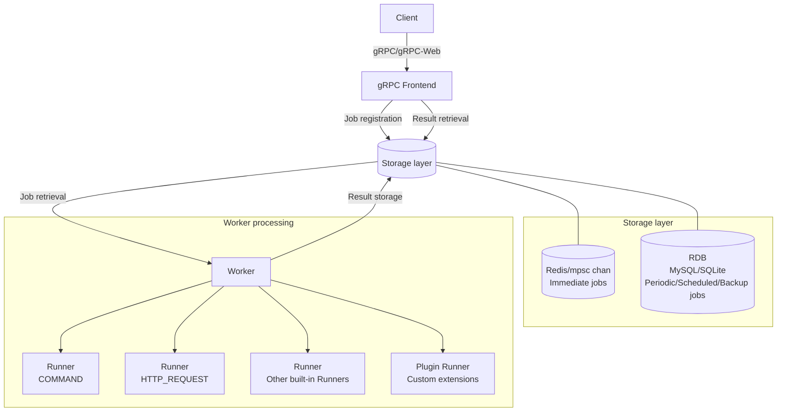

# jobworkerp-rs

[Japanese ver.](README_ja.md)

## Overview

jobworkerp-rs is a scalable job worker system implemented in Rust.
The job worker system is used to process CPU-intensive and I/O-intensive tasks asynchronously.
Using gRPC, you can define [Workers](proto/protobuf/jobworkerp/service/worker.proto), register [Jobs](proto/protobuf/jobworkerp/service/job.proto) for task execution, and retrieve execution results.
Processing capabilities can be extended through plugins.

## Architecture Overview

jobworkerp-rs consists of the following main components:

- **gRPC Frontend**: An interface that accepts requests from clients and handles job registration/retrieval
- **Worker**: The component that performs the actual job processing, configurable with multiple channels and parallelism settings
- **Storage**: A combination of Redis (for immediate jobs) and RDB (MySQL/SQLite, for scheduled/periodic jobs)



### Main Features

#### Job Management Features
- Storage options for job queues: Choose between Redis and RDB (MySQL or SQLite) based on requirements
- Retry functionality for failed jobs: Configure retry count and intervals (Exponential backoff and others)
- Scheduled execution at specific times

#### Result Retrieval and Notification
- Two methods for retrieving job execution results: Direct retrieval (DIRECT), No result retrieval (NONE)
- Real-time result notification (broadcast_results): Result distribution to multiple clients, streaming retrieval (See [STREAMING.md](STREAMING.md) for details)

#### Execution Environment and Scalability
- Job execution channel configuration with parallel execution settings per channel
  - For example, you can set GPU channel to execute with parallelism of 1, while normal channel executes with parallelism of 4
  - Each worker server can process jobs with specified channels and parallelism, allowing adjustment of job execution servers and parallelism

#### Extensibility
- Extensible job execution content (Runner) through plugins
- Model Context Protocol (MCP) proxy functionality: Access LLMs and various tools provided by MCP servers through Runners
- Workflow functionality: Execute multiple jobs in coordination

<!-- START doctoc generated TOC please keep comment here to allow auto update -->
<!-- DON'T EDIT THIS SECTION, INSTEAD RE-RUN doctoc TO UPDATE -->

- [Command Examples](#command-examples)
  - [Build and Launch](#build-and-launch)
    - [Launch Example Using Docker Image](#launch-example-using-docker-image)
  - [Execution Examples Using jobworkerp-client](#execution-examples-using-jobworkerp-client)
- [Detailed Features of jobworkerp-worker](#detailed-features-of-jobworkerp-worker)
  - [Built-in Functions of worker.runner_id](#built-in-functions-of-workerrunner_id)
  - [Job Queue Types](#job-queue-types)
  - [Result Storage (worker.store_success, worker.store_failure)](#result-storage-workerstore_success-workerstore_failure)
  - [Result Retrieval Methods (worker.response_type)](#result-retrieval-methods-workerresponse_type)
  - [MCP Proxy Functionality](#mcp-proxy-functionality)
  - [Workflow Runners](#workflow-runners)
- [Other Details](#other-details)
  - [Worker Definition](#worker-definition)
  - [RDB Definition](#rdb-definition)
  - [Environment Variables](#environment-variables)
- [About Plugins](#about-plugins)
  - [About Error Codes](#about-error-codes)
- [Operational Notes](#operational-notes)

<!-- END doctoc generated TOC please keep comment here to allow auto update -->

## Command Examples

### Build and Launch

```shell
# prepare .env file
$ cp dot.env .env

# build release binaries (use mysql)
$ cargo build --release --features mysql

# build release binaries (use sqlite)
$ cargo build --release

# Run the all-in-one server by release binary
$ ./target/release/all-in-one

# Run gRPC front server and worker by release binary
$ ./target/release/worker &
$ ./target/release/grpc-front &
```

#### Launch Example Using Docker Image

```shell
# Launch with docker-compose (for development)
$ docker-compose up

# Launch with scalable configuration (for production)
$ docker-compose -f docker-compose-scalable.yml up --scale worker=3
```

#### Building Docker Image Locally

There are two Dockerfiles available for the all-in-one image:

| Dockerfile | Purpose | Description |
|------------|---------|-------------|
| `Dockerfile` | GitHub Actions / Pre-built binary | Requires pre-built `./target/release/all-in-one` binary. Builds only admin-ui inside Docker. |
| `Dockerfile.full` | Local development | Full multi-stage build. Builds both Rust binary and admin-ui inside Docker. No pre-built binary required. |

```shell
# Option 1: Using pre-built binary (Dockerfile)
# First build the Rust binary locally
$ cargo build --release
# Then build the Docker image
$ docker build -t jobworkerp-all-in-one .

# Option 2: Full build inside Docker (Dockerfile.full)
# No pre-built binary required - everything is built inside Docker
$ docker build -f Dockerfile.full -t jobworkerp-all-in-one .

# Run the container
# - Port 80: Admin UI (nginx)
# - Port 9000: gRPC-Web (for admin-ui to connect)
$ docker run -p 80:80 -p 9000:9000 \
  -e VITE_GRPC_ENDPOINT=http://localhost:9000 \
  -e USE_GRPC_WEB=true \
  -e JOB_STATUS_RDB_INDEXING=true \
  jobworkerp-all-in-one

# For remote access, replace localhost with your server's IP address
$ docker run -p 80:80 -p 9000:9000 \
  -e VITE_GRPC_ENDPOINT=http://<your-server-ip>:9000 \
  -e USE_GRPC_WEB=true \
  -e JOB_STATUS_RDB_INDEXING=true \
  jobworkerp-all-in-one
```

**Required environment variables for admin-ui:**
| Variable | Description |
|----------|-------------|
| `VITE_GRPC_ENDPOINT` | gRPC-Web endpoint URL that admin-ui connects to |
| `USE_GRPC_WEB` | Must be `true` to enable gRPC-Web protocol |
| `JOB_STATUS_RDB_INDEXING` | Must be `true` to display job list in admin-ui |

> **Note**: `Dockerfile.full` takes longer to build but is convenient for local development as it doesn't require a local Rust toolchain.

### Execution Examples Using jobworkerp-client

Using [jobworkerp-client](https://github.com/jobworkerp-rs/jobworkerp-client-rs), you can create/retrieve workers, enqueue jobs, and get processing results as follows:

(If you don't need to encode/decode worker.runner_settings, job.job_arg, and job_result.output, you can also execute using grpcurl. Reference: [proto files](proto/protobuf/jobworkerp/service/))

#### Setup

```shell
# clone
$ git clone https://github.com/jobworkerp-rs/jobworkerp-client-rs
$ cd jobworkerp-client-rs

# build
$ cargo build --release

# run (show help)
$ ./target/release/jobworkerp-client

# list runner (need launching jobworkerp-rs in localhost:9000(default))
$ ./target/release/jobworkerp-client runner list
```

#### Normal Job Execution (Direct Result Retrieval)

```shell
# create worker (specify runner id from runner list)
1. $ ./target/release/jobworkerp-client worker create --name "ExampleRequest" --description "" --runner-id 2 --settings '{"base_url":"https://www.example.com/search"}' --response-type DIRECT

# enqueue job (ls . ..)
# specify worker_id value or worker name created by `worker create` (command 1. response)
2-1. $ ./target/release/jobworkerp-client job enqueue --worker 1 --args '{"headers":[],"method":"GET","path":"/search","queries":[{"key":"q","value":"test"}]}'
2-2. $ ./target/release/jobworkerp-client job enqueue --worker "ExampleRequest" --args '{"headers":[],"method":"GET","path":"/search","queries":[{"key":"q","value":"test"}]}'
```

#### Real-time Result Notification Job

```shell
# create shell command `sleep` worker (must specify store_success and store_failure to be true)
1. $ ./target/release/jobworkerp-client worker create --name "SleepWorker" --description "" --runner-id 1 --settings '' --response-type NO_RESULT --broadcast-results --store-success --store-failure

# enqueue job
# sleep 60 seconds
2. $ ./target/debug/jobworkerp-client job enqueue --worker 'SleepWorker' --args '{"command":"sleep","args":["60"]}'

# listen job (long polling with grpc)
# specify job_id created by `job enqueue` (command 2. response)
3. $ ./target/release/jobworkerp-client job-result listen --job-id <got job id above> --timeout 70000 --worker 'SleepWorker'
# (The response is returned as soon as the result is available, to all clients to listen. You can request repeatedly)
```

#### Periodic Job Execution

```shell
# create periodic worker (repeat per 3 seconds)
1. $ ./target/release/jobworkerp-client worker create --name "PeriodicEchoWorker" --description "" --runner-id 1 --settings '' --periodic 3000 --response-type NO_RESULT --store-success --store-failure --broadcast-results

# enqueue job (echo Hello World !)
# start job at [epoch second] % 3 == 1, per 3 seconds by run_after_time (epoch milliseconds) (see info log of jobworkerp all-in-one execution)
# (If run_after_time is not specified, the command is executed repeatedly based on enqueue_time)
2. $ ./target/debug/jobworkerp-client job enqueue --worker 'PeriodicEchoWorker' --args '{"command":"echo","args":["Hello", "World", "!"]}' --run-after-time 1000

# listen by worker (stream)
 ./target/release/jobworkerp-client job-result listen-by-worker --worker 'PeriodicEchoWorker'

# stop periodic job 
# specify job_id created by `job enqueue` (command 2. response)
3. $ ./target/debug/jobworkerp-client job delete --id <got job id above>
```

## Detailed Features of jobworkerp-worker

### Built-in Functions of worker.runner_id

The following features are built into the runner definition.
Each feature requires setting necessary values in protobuf format for worker.runner_settings and job.args. The protobuf definitions can be obtained from runner.runner_settings_proto and runner.job_arg_proto.

| Runner ID | Name | Description | Settings |
|----------|------|-------------|---------|
| COMMAND | Command execution | Executes shell commands | worker.runner_settings: command name, job.args: argument array |
| PYTHON_COMMAND | Python execution | Executes Python scripts using uv | worker.runner_settings: uv environment settings, job.args: python script, input, etc. |
| HTTP_REQUEST | HTTP requests | HTTP communication using reqwest | worker.runner_settings: base URL, job.args: headers, method, body, path, etc. |
| GRPC_UNARY | gRPC communication | gRPC unary requests | worker.runner_settings: URL+path, job.args: protobuf encoded arguments |
| DOCKER | Docker container execution | Equivalent to docker run | worker.runner_settings: FromImage/Tag, job.args: Image/Cmd, etc. |
| SLACK_POST_MESSAGE | Slack message posting | Posts messages to Slack channels | worker.runner_settings: Slack API settings, job.args: channel, message content, etc. |
| LLM | LLM execution (multi-method) | Uses various LLMs (external servers/local execution) | using: "completion" or "chat", worker.runner_settings: model settings, job.args: prompts/messages |
| WORKFLOW | Workflow execution (multi-method) | Executes multiple jobs in defined order | using: "run" (default) or "create", worker.runner_settings: workflow definition, job.args: input data |

#### LLM Runner Details

The LLM runner is a multi-method runner that uses the `using` parameter to specify the method:

- **completion**: Text completion (prompt-based)
- **chat**: Chat conversation (with message history and tool calling support)

**Supported LLM Execution Methods**:
- **External servers**: Ollama, OpenAI API-compatible servers, etc.
- **Local execution**: On-device inference using MistralRS (requires `local_llm` feature)

**Tool Calling**: The chat method supports providing tools to the LLM via FunctionSets. The `is_auto_calling` option controls automatic/manual mode:
- `is_auto_calling: true` - Automatically execute tools when LLM returns tool calls
- `is_auto_calling: false` (default) - Return tool calls to client for review/modification before execution

**Enabling Local LLM Features**:
```bash
# Build with local LLM features enabled
cargo build --release --features local_llm

# Enable GPU acceleration (automatically enables local_llm)
cargo build --release --features metal  # macOS Metal
cargo build --release --features cuda   # NVIDIA CUDA
```

**Note**: When using Settings::Local, you must build with one of the above features.

**Deprecated**: `LLM_COMPLETION` and `LLM_CHAT` are deprecated. Use the `LLM` runner with the `using` parameter instead.

### Job Queue Types

Environment variable `STORAGE_TYPE`

- Standalone: Immediate jobs use memory (mpsc, mpmc channel), while scheduled jobs are stored in RDB (sqlite, mysql). Only supports single instance execution
- Scalable: Immediate jobs use Redis, while scheduled jobs are stored in RDB (sqlite, mysql). This allows multiple grpc-front and worker instances to be configured
  - Must be built with `--features mysql` when building with cargo

worker.queue_type

- NORMAL: Immediate execution jobs (regular jobs without time specification) are stored in channel (redis), while periodic and scheduled jobs are stored in db
- WITH_BACKUP: Immediate execution jobs are stored in both channel and RDB (can restore jobs from RDB during failures)
- DB_ONLY: Immediate execution jobs are also stored only in RDB (may result in slower execution)

### Result Storage (worker.store_success, worker.store_failure)

- Execution results are saved to RDB (job_result table) on success/failure based on worker.store_success and worker.store_failure settings
- Results can be referenced after execution using [JobResultService](proto/protobuf/jobworkerp/service/job_result.proto)

### Result Retrieval Methods (worker.response_type)

There are two methods for retrieving results via worker.response_type:

- No result retrieval (NO_RESULT): (Default value) Returns Job ID in response. If results are stored, they can be retrieved after job completion using [JobResultService/FindListByJobId](proto/protobuf/jobworkerp/service/job_result.proto)
- Direct retrieval (DIRECT): Waits for execution completion in the enqueue request and returns results directly in the response (If results are not stored, only the requesting client can obtain results)

Additionally, when worker.broadcast_results is enabled:

- Immediate result notification: After enqueue, results can be retrieved immediately after execution completion using the Listen feature of [job_result](proto/protobuf/jobworkerp/service/job_result.proto) service (Long polling method)
  - Multiple clients can Listen and receive the same results (delivered via Redis pubsub)
  - See the "listen result after request" example in the "Execution Examples Using jobworkerp-client" section
- You can continuously receive execution results from a specific worker as a stream (JobResultService.ListenByWorker)

### MCP Proxy Functionality

Model Context Protocol (MCP) is a standard communication protocol between LLM applications and tools. jobworkerp-rs's MCP proxy functionality enables you to:

- Execute MCP tools (LLMs, time information retrieval, web page fetching, etc.) provided by various MCP servers as Runners
- Run MCP tools as asynchronous jobs and retrieve their results
- Configure multiple MCP servers and combine different tools

#### MCP Server Configuration

MCP server configurations are defined in a TOML file. Here's an example configuration:

```toml
[[server]]
name = "time"
description = "timezone"
protocol = "stdio"
command = "uvx"
args = ["mcp-server-time", "--local-timezone=Asia/Tokyo"]

[[server]]
name = "fetch"
description = "fetch web page as markdown from web"
protocol = "stdio"
command = "uvx"
args = ["mcp-server-fetch"]

# SSE protocol example
#[[server]]
#name = "test-server"
#protocol = "sse"
#url = "http://localhost:8080"
```

Place the configuration file at the path specified by the `MCP_CONFIG` environment variable. If the environment variable is not set, the default path `mcp-settings.toml` will be used.

#### MCP Proxy Usage Examples

1. Prepare an MCP server configuration file
2. When creating a worker, specify the numeric ID of the specific MCP server as runner_id (you can check available MCP servers using the `jobworkerp-client runner list` command)
3. Specify tool_name and arg_json in job execution arguments

```shell
# First, check the available runner-id
$ ./target/release/jobworkerp-client runner list
# Identify the specific MCP server's ID here (e.g., 3 for "time" server)

# Create a worker that uses an MCP server (e.g., time information retrieval)
# Specify the MCP server's ID number confirmed above for runner-id
$ ./target/release/jobworkerp-client worker create --name "TimeInfo" --description "" --runner-id <runner id> --response-type DIRECT --settings '' --use-static

# Execute a job to retrieve current time information
$ ./target/release/jobworkerp-client job enqueue --worker "TimeInfo" --args '{"tool_name":"get_current_time","arg_json":"{\"timezone\":\"Asia/Tokyo\"}"}'

# Web page fetching example
$ ./target/release/jobworkerp-client worker create --name "WebFetch" --description "" --response-type DIRECT --settings '' --runner-id <runner id>
$ ./target/release/jobworkerp-client job enqueue --worker "WebFetch" --args '{"tool_name":"fetch","arg_json":"{\"url\":\"https://example.com\"}"}'
```

Responses from the MCP server can be retrieved as job results and processed directly or asynchronously according to the response_type setting.

> **Note**: Runners that take time to initialize, such as PYTHON_COMMAND or MCP server tools (stdio), can be reused without reinitializing the MCP server process for each tool execution by setting the `use_static` option to `true` when creating a worker. This increases memory usage but improves execution speed.

For detailed MCP protocol specifications, refer to the [official documentation](https://modelcontextprotocol.io/).
For information about the MCP server samples used above, refer to the [official documentation](https://github.com/modelcontextprotocol/servers).


### Workflow Runner

The Workflow Runner is a feature that allows executing multiple jobs in a defined order or executing reusable workflows. This feature is based on [Serverless Workflow](https://serverlessworkflow.io/) (v1.0.0), with some features removed and jobworkerp-rs-specific extensions added (runner and worker for run tasks). ([Details (schema)](runner/schema/workflow.yaml))

- **INLINE_WORKFLOW**: Executes a workflow defined in job arguments ([InlineWorkflowRunner](infra/src/infra/runner/inline_workflow.rs))
  - Can execute a workflow once by passing the entire workflow definition as a job argument
  - Workflows can be specified as a URL to a workflow definition file or as YAML/JSON format workflow definition data
  - Supports dynamic variable expansion using both jq syntax (${}) and Liquid template syntax ($${})

- **REUSABLE_WORKFLOW**: Executes a reusable workflow ([ReusableWorkflowRunner](infra/src/infra/runner/reusable_workflow.rs))
  - Can save workflow definitions as a worker and execute them repeatedly
  - Sets the workflow definition in worker.runner_settings and provides only input data as job arguments during execution
  - Supports variable expansion using jq and Liquid template syntax, similar to INLINE_WORKFLOW

#### Workflow Example

Below is an example of a workflow that lists files and further processes directories:
($${...}: Liquid template, ${...}: jq)

```yaml
document:
  id: 1
  name: ls-test
  namespace: default
  title: Workflow test (ls)
  version: 0.0.1
  dsl: 0.0.1
input:
  schema:
    document:
      type: string
      description: file name
      default: /
do:
  - ListWorker:
      run:
        runner:
          name: COMMAND
          arguments:
            command: ls
            args: ["${.}"]
          options: 
            channel: workflow
            useStatic: false
            storeSuccess: true
            storeFailure: true
      output:
        as: |- 
          $${
          
          {"files": [
          
          "{{- file |strip_newlines -}}",
          
          ] }
          }
  - EachFileIteration:
      for:
        each: file
        in: ${.files}
        at: ind
      do:
        - ListWorkerInner:
            if: |-
              $${truefalse}
            run:
              runner:
                name: COMMAND
                arguments:
                  command: ls
                  args: ["$${/{{file}}}"]
                options:
                  channel: workflow
                  useStatic: false
                  storeSuccess: true
                  storeFailure: true
```

#### How to Use the Workflow Runner

Methods for using the workflow runner with jobworkerp-client:

If you save the above workflow definition as `ls.yaml` in the same directory as the worker process:

```shell
# INLINE_WORKFLOW - One-time execution of a workflow
$ ./target/release/jobworkerp-client worker create --name "OneTimeFlow" --description "" --runner-id 65535 --response-type DIRECT --settings ''
$ ./target/release/jobworkerp-client job enqueue --worker "OneTimeFlow" --args '{"workflow_url":"./ls.yaml", "input":"/home"}'

# REUSABLE_WORKFLOW - Creating a reusable workflow
$ ./target/release/jobworkerp-client worker create --name "ReusableFlow" --description "" --runner-id <REUSABLE_WORKFLOW_ID> --settings '{"json_data":"<YAML or JSON workflow definition string>"}' --response-type DIRECT
$ ./target/release/jobworkerp-client job enqueue --worker "ReusableFlow" --args '{"input":"..."}'

# Method to execute a workflow directly without creating a worker (shortcut)
$ ./target/release/jobworkerp-client job enqueue-workflow -i '/path/to/list' -w ./ls.yml
# This command automatically creates a temporary worker, executes the workflow, and deletes the worker
# (In the future, we plan to enable job execution without creating a temporary worker)
```

> **Note**: workflow_url can specify not only URLs like `https://` but also absolute/relative paths to files on the local filesystem. If a relative path is specified, it must be relative to the execution directory of jobworkerp-worker.

## Other Details

### Worker Definition

- **run_after_time**: Specifies the execution time of the job (epoch time)
- **timeout**: Timeout duration
- **worker.periodic_interval**: Interval for periodic job execution (must be greater than 1)
- **worker.retry_policy**: Retry policy for job execution failures (RetryType: CONSTANT, LINEAR, EXPONENTIAL), maximum retries (max_retry), maximum interval (max_interval), etc.
- **worker.next_workers**: Executes another worker after job completion using the result as arguments (Specify worker.id as a comma-separated list)
  - The specified worker must be able to process the result value directly as job_arg
- **worker.use_static**: Allows static allocation of runner processes for parallelism (pooling runners without initializing them each time)
- **worker.broadcast_results**: Enables real-time notification of job execution results (true/false)
  - Multiple clients can simultaneously retrieve results (uses Redis pubsub)

### RDB Definition

Database schema:
- [MySQL schema](infra/sql/mysql/002_worker.sql)
- [SQLite schema](infra/sql/sqlite/002_schema.sql)

(The runner table contains fixed records as built-in features)

### Environment Variables

(Refer to the [dot.env](dot.env) file for specific examples)

| Category | Environment Variable Name | Description | Default Value |
|---------|----------------------------|-------------|---------------|
| **Runner Execution Settings** | PLUGINS_RUNNER_DIR | Directory for storing plugins | plugins |
| | DOCKER_GID | Docker group ID (for DockerRunner) | - |
| **Job Queue Settings** | WORKER_DEFAULT_CONCURRENCY | Default channel concurrency | 4 |
| | WORKER_CHANNELS | Names of additional job queue channels (comma-separated) | - |
| | WORKER_CHANNEL_CONCURRENCIES | Concurrency of additional job queue channels (comma-separated) | - |
| **Log Settings** | LOG_LEVEL | Log level (trace, debug, info, warn, error) | info |
| | LOG_FILE_DIR | Directory for log output | - |
| | LOG_USE_JSON | Whether to output logs in JSON format (boolean) | false |
| | LOG_USE_STDOUT | Whether to output logs to stdout (boolean) | true |
| | OTLP_ADDR | Retrieve request metrics using otlp | - |
| **Storage Settings** | STORAGE_TYPE | Standalone: Single instance, Scalable: Multiple instances | Standalone |
| | JOB_QUEUE_EXPIRE_JOB_RESULT_SECONDS | Maximum wait time for worker.broadcast_results=true | 3600 |
| | JOB_QUEUE_FETCH_INTERVAL | Interval for periodic fetch of jobs stored in RDB | 1000 |
| | STORAGE_REFLESH_FROM_RDB | Flag for restoring jobs after crashes | false |
| **gRPC Settings** | GRPC_ADDR | gRPC server address:port | [::1]:9000 |
| | USE_GRPC_WEB | Whether to use gRPC web on the gRPC server (boolean) | false |
| **MCP Settings** | MCP_CONFIG | Path to MCP server configuration file | mcp-settings.toml |

## About Plugins

### Plugin Development

- Implement the [Runner trait](infra/src/infra/runner/plugins.rs) as a dylib
  - Place it in the directory specified by the `PLUGINS_RUNNER_DIR` environment variable to register it as a runner
  - Example implementation: [HelloPlugin](plugins/hello_runner/src/lib.rs)

### About Error Codes

TBD

## Operational Notes

- For periodic job execution, the periodic interval (in milliseconds) specified in `.env` must not be shorter than JOB_QUEUE_FETCH_INTERVAL (interval for periodic job fetch queries to RDB)
  - For time-specified jobs, prefetching from RDB ensures execution at the specified time even if there is a delay between fetch and execution
- Workers terminate gracefully upon receiving a SIGINT (Ctrl + c) signal, waiting for ongoing job execution to complete
- IDs (e.g., job IDs) use snowflake, with machine IDs derived from the 10-bit host part of each host's IPv4 address. Avoid using subnets with host parts exceeding 10 bits or instances with identical host parts across different subnets, as this may result in duplicate job IDs.
- When executing worker.type = DOCKER on k8s environments, Docker Outside Of Docker or Docker in Docker settings are required (untested)
- If a panic occurs within the runner plugin's processing, the worker process itself will crash. It is recommended to operate workers with fault-tolerant systems such as supervisord or Kubernetes deployment. (Applying C-unwind is a future consideration)
