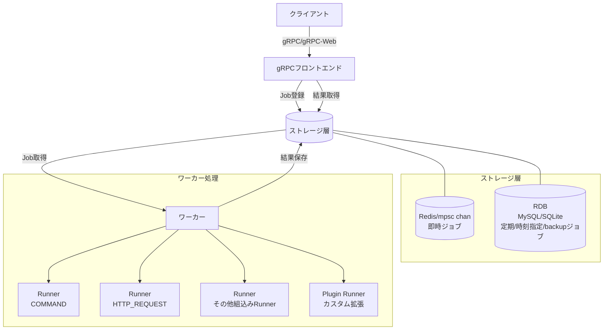

# jobworkerp-rs

## 概要

jobworkerp-rs は、Rustで実装されたスケーラブルなジョブワーカーシステム。
ジョブワーカーシステムは、CPU負荷やI/O負荷の高いタスクを非同期に処理するために利用する。
GRPCをつかって処理内容となる[Worker](proto/protobuf/jobworkerp/service/worker.proto)の定義・処理実行のための[Job](proto/protobuf/jobworkerp/service/job.proto)の登録、実行結果の取得などを実行できる。
プラグイン形式で処理を拡張できる。

## アーキテクチャ概要

jobworkerp-rsは以下の主要コンポーネントで構成されています：

- **gRPC フロントエンド**: クライアントからのリクエストを受け付け、ジョブの登録・取得を行うインターフェース
- **ワーカー**: 実際のジョブ処理を行うコンポーネント、複数のチャンネルと並列度の設定が可能
- **ストレージ**: Redis（即時ジョブ）とRDB（MySQL/SQLite、定期実行/時刻指定ジョブ）の組み合わせ



## 主な機能

### ジョブ管理機能
- ジョブキューとして利用できるストレージ: 状況に応じてRedis、RDB（MySQLまたはSQLite）を使いわける
- ジョブ実行失敗時のリトライ機能: リトライ回数や間隔の設定（Exponential backoff 他）
- 指定時刻実行が可能です

### 結果取得と通知
- 2種類のジョブ実行結果の取得方法: 直接取得（DIRECT）、結果取得しない（NONE）
- リアルタイム結果通知機能（broadcast_results）: 複数クライアントへの結果配信、ストリーミング取得

### 実行環境とスケーラビリティ
- ジョブ実行チャネルの設定とチャネル毎の並列実行数の設定
  - 例えば、GPUチャネルでは並列度1で実行、通常チャネルでは並列度4で実行などの設定が可能
  - 各ワーカーサーバではチャンネルと並列度を指定してジョブ処理できるので、ジョブの実行サーバと並列度を調整可能

### 拡張機能
- プラグインによる実行ジョブ内容（Runner）の拡張
- Model Context Protocol (MCP) プロキシ機能: MCPサーバーで提供されるLLMや各種ツールをRunner経由で利用可能
- ワークフロー機能: 複数のジョブを連携して実行

## 目次

- [クイックスタート](#クイックスタート)
  - [ビルドと起動](#ビルドと起動)
  - [Docker環境での実行](#docker環境での実行)
  - [クライアントによる実行例](#クライアントによる実行例)
- [機能詳細](#機能詳細)
  - [組み込みRunner機能](#組み込みrunner機能)
  - [ジョブキュー種別](#ジョブキュー種別)
  - [結果の格納と取得](#結果の格納と取得)
  - [MCPプロキシ機能](#mcpプロキシ機能)
  - [WorkflowRunner](#WorkflowRunner)
- [設定と環境変数](#設定と環境変数)
  - [worker設定パラメータ](#worker設定パラメータ)
  - [RDB設定](#rdb設定)
  - [環境変数一覧](#環境変数一覧)
- [拡張と開発](#拡張と開発)
  - [プラグイン開発](#プラグイン開発)
  - [エラーコード](#エラーコード)
- [運用上の注意点](#運用上の注意点)

## クイックスタート

### ビルドと起動

```shell
# prepare .env file
$ cp dot.env .env

# build release binaries (use mysql)
$ cargo build --release --features mysql

# build release binaries (use sqlite)
$ cargo build --release

# Run the all-in-one server by release binary
$ ./target/release/all-in-one

# Run gRPC front server and worker by release binary
$ ./target/release/worker &
$ ./target/release/grpc-front &
```

### Docker環境での実行

```shell
# docker-compose で起動（開発環境向け）
$ docker-compose up

# スケーラブル構成で起動（本番環境向け）
$ docker-compose -f docker-compose-scalable.yml up --scale worker=3
```

### クライアントによる実行例

[jobworkerp-client](https://github.com/jobworkerp-rs/jobworkerp-client-rs)をつかって以下のようにworkerの作成・取得、jobのenqueue、処理結果の取得が可能です。

#### セットアップ

```shell
# clone
$ git clone https://github.com/jobworkerp-rs/jobworkerp-client-rs
$ cd jobworkerp-client-rs

# build
$ cargo build --release

# run (show help)
$ ./target/release/jobworkerp-client

# list runner (need launching jobworkerp-rs in http://localhost:9000(default))
$ ./target/release/jobworkerp-client runner list
```

#### 通常ジョブ実行（結果直接取得）

```shell
# create worker (specify runner id from runner list)
1. $ ./target/release/jobworkerp-client worker create --name "ExampleRequest" --description "" --runner-id 2 --settings '{"base_url":"https://www.example.com/search"}' --response-type DIRECT

# enqueue job (ls . ..)
# specify worker_id value or worker name created by `worker create` (command 1. response)
2-1. $ ./target/release/jobworkerp-client job enqueue --worker 1 --args '{"headers":[],"method":"GET","path":"/search","queries":[{"key":"q","value":"test"}]}'
2-2. $ ./target/release/jobworkerp-client job enqueue --worker "ExampleRequest" --args '{"headers":[],"method":"GET","path":"/search","queries":[{"key":"q","value":"test"}]}'
```

#### リアルタイム結果通知ジョブ

```shell
# create shell command `sleep` worker (must specify store_success and store_failure to be true)
1. $ ./target/release/jobworkerp-client worker create --name "SleepWorker" --description "" --runner-id 1 --settings '' --response-type NO_RESULT --broadcast-results --store-success --store-failure

# enqueue job
# sleep 60 seconds
2. $ ./target/debug/jobworkerp-client job enqueue --worker 'SleepWorker' --args '{"command":"sleep","args":["60"]}'

# listen job (long polling with grpc)
# specify job_id created by `job enqueue` (command 2. response)
3. $ ./target/release/jobworkerp-client job-result listen --job-id <got job id above> --timeout 70000 --worker 'SleepWorker'
# (The response is returned as soon as the result is available, to all clients to listen. You can request repeatedly)
```

#### 定期実行ジョブ

```shell
# create periodic worker (repeat per 3 seconds)
1. $ ./target/release/jobworkerp-client worker create --name "PeriodicEchoWorker" --description "" --runner-id 1 --settings '' --periodic 3000 --response-type NO_RESULT --store-success --store-failure --broadcast-results

# enqueue job (echo Hello World !)
# start job at [epoch second] % 3 == 1, per 3 seconds by run_after_time (epoch milliseconds) (see info log of jobworkerp all-in-one execution)
# (If run_after_time is not specified, the command is executed repeatedly based on enqueue_time)
2. $ ./target/debug/jobworkerp-client job enqueue --worker 'PeriodicEchoWorker' --args '{"command":"echo","args":["Hello", "World", "!"]}' --run-after-time 1000

# listen by worker (stream)
 ./target/release/jobworkerp-client job-result listen-by-worker --worker 'PeriodicEchoWorker'

# stop periodic job 
# specify job_id created by `job enqueue` (command 2. response)
3. $ ./target/debug/jobworkerp-client job delete --id <got job id above>
```

## 機能詳細

### 組み込みRunner機能

worker_runnerに組み込み定義されている機能を以下に記載します。
各機能のworker.runner_settings、job.argsにはprotobufでそれぞれの機能に必要な値を設定します。[protobuf定義](runner/protobuf/jobworkerp/runner)は[RunnerService](proto/protobuf/jobworkerp/service/runner.proto)によりrunner.data.runner_settings_proto, runner.data.job_arg_protoとして取得可能です。

| Runner ID | 名称 | 説明 | 設定項目 |
|----------|------|------|---------|
| COMMAND | コマンド実行 | シェルコマンドを実行 | worker.runner_settings: コマンド名, job.args: 引数配列 |
| PYTHON_COMMAND | pythonコマンド実行 | uvを利用したpython script実行 | worker.runner_settings: uv環境設定, job.args: python script、入力など |
| HTTP_REQUEST | HTTPリクエスト | reqwestによるHTTP通信 | worker.runner_settings: base URL, job.args: headers, method, body, path など |
| GRPC_UNARY | gRPC通信 | gRPC unaryリクエスト | worker.runner_settings: URL+path, job.args: protobufエンコード引数 |
| DOCKER | Dockerコンテナ実行 | docker run相当 | worker.runner_settings: FromImage/Tag, job.args: Image/Cmd など |
| LLM_COMPLETION | LLM文章生成 | 各種LLM(外部サーバ)を利用 | worker.runner_settings: モデル設定, job.args: プロンプト/オプション |
| INLINE_WORKFLOW/REUSABLE_WORKFLOW | ワークフロー実行 | 複数のジョブを定義された順序で実行 | worker.runner_settings: ワークフロー定義, job.args: 入力データ |

### ジョブキュー種別

環境変数`STORAGE_TYPE`で全体の動作モードを設定します：

- **Standalone**: 即時ジョブは memory(mpsc, mpmc channel) 、時刻指定ジョブなどはrdb(sqlite, mysql)に格納するためシングルインスタンスでの実行のみサポート
- **Scalable**: 即時ジョブは redis 、時刻指定ジョブなどはrdb(sqlite, mysql)に格納するためgrpc-front、workerをそれぞれ複数台で構成することができる
  - cargoでのビルド時に `--features mysql` を付けてビルドする必要があります

worker.queue_typeでは個別のジョブキュー種別を指定します：

- **NORMAL**: 即時実行ジョブ(時刻指定のない通常のジョブ)はchannel (redis) に、定期実行や時刻指定ジョブはdbに格納
- **WITH_BACKUP**: 即時実行ジョブをchannelとrdbの両方に格納する(障害時にrdb内のジョブをリストアできる)
- **FORCED_RDB**: 即時実行ジョブもrdbのみに格納する (実行が遅くなることがある)

### 結果の格納と取得

#### 結果の格納
- worker.data.store_success、worker.data.store_failureの指定により実行成功、失敗時にrdb(job_resultテーブル) に保存
- [JobResultService](proto/protobuf/jobworkerp/service/job_result.proto)で実行後に参照できます

#### 結果の取得方法

worker.response_typeにより以下の取得方法があります：

- **結果取得なし (NO_RESULT)**: (デフォルト値) Job IDがレスポンスで返される。結果を格納している場合はjobの終了後に [JobResultService/FindListByJobId](proto/protobuf/jobworkerp/service/job_result.proto) をつかって取得できる。
- **直接取得(DIRECT)**: enqueueリクエストで実行完了まで待ち、そのレスポンスとして直接結果が得られる。(結果を格納していない場合はリクエストしたクライアントのみ結果を取得可能)

また、worker.data.broadcast_resultsを有効にすると:

- 実行結果の即時通知: enqueue後、[job_result](proto/protobuf/jobworkerp/service/job_result.proto)サービスのListenを使って実行終了後すぐに結果を取得できる。(ロングポーリング方式)
  - 複数のクライアントがListenして全クライアントが同じ結果を得ることができます (Redis pubsubでの伝達)
  - 使用例は「クライアントによる実行例」セクションの「リアルタイム結果通知ジョブ」を参照してください
- 特定workerの実行結果をストリームとして取得しつづけられます (JobResultService.ListenByWorker)

### MCPプロキシ機能

Model Context Protocol (MCP) は、LLMアプリケーションとツール間の標準通信プロトコルです。jobworkerp-rsのMCPプロキシ機能を使用することで、以下のことが可能になります：

- 各種MCPサーバーが提供する機能（LLM、時間情報取得、Webページ取得など）をRunnerとして実行
- 非同期ジョブとしてMCPツールを実行し、結果を取得
- 複数のMCPサーバーを設定し、異なるツールをそれぞれ利用

#### MCPサーバー設定

MCPサーバーの設定はTOMLファイルで行います。以下は設定例です：

```toml
[[server]]
name = "time"
description = "timezone"
protocol = "stdio"
command = "uvx"
args = ["mcp-server-time", "--local-timezone=Asia/Tokyo"]

[[server]]
name = "fetch"
description = "fetch web page as markdown from web"
protocol = "stdio"
command = "uvx"
args = ["mcp-server-fetch"]

# SSEプロトコルの例
#[[server]]
#name = "test-server"
#protocol = "sse"
#url = "http://localhost:8080"
```

設定ファイルは環境変数 `MCP_CONFIG` に指定したパスに配置します。環境変数を設定していない場合は、デフォルトで `mcp-settings.toml` が使用されます。(無い場合は無視されます)

#### MCPプロキシの使用例

1. MCPサーバー設定ファイルを準備する
2. worker作成時にrunner_idにMCPランナーの数値IDを指定（`jobworkerp-client runner list` コマンドで確認できます）
3. ジョブ実行時の引数にtool_nameとarg_jsonを指定する

```shell
# まず利用可能なrunner-idを確認する
$ ./target/release/jobworkerp-client runner list
# ここでMCPランナーのIDを確認（例: 3）

# MCPサーバーを使用するワーカーを作成（例：時間情報取得）
# runner-idには上記で確認したMCPランナーのID番号を指定
$ ./target/release/jobworkerp-client worker create --name "TimeInfo" --description "" --runner-id <runner id> --response-type DIRECT --settings '' --use-static

# ジョブを実行して現在の時間情報を取得
$ ./target/release/jobworkerp-client job enqueue --worker "TimeInfo" --args '{"tool_name":"get_current_time","arg_json":"{\"timezone\":\"Asia/Tokyo\"}"}'

# Webページ取得の例
$ ./target/release/jobworkerp-client worker create --name "WebFetch" --description "" --response-type DIRECT --settings '' --runner-id <runner id>
$ ./target/release/jobworkerp-client job enqueue --worker "WebFetch" --args '{"tool_name":"fetch","arg_json":"{\"url\":\"https://example.com\"}"}'
```

MCPサーバーからの応答はジョブ結果として取得でき、response_typeの設定に従って直接または非同期に処理できます。

> **注意**: PYTHON_COMMANDやMCPサーバプロキシによるMCPサーバツールの実行(stdio)など初期化に時間がかかるRunnerは、worker作成時に`use_static`オプションを`true`に設定することで、ツール実行ごとにMCPサーバプロセスを初期化することなく再利用できます。これによりメモリ使用量は増加しますが、実行速度が向上します。

詳細なMCPプロトコル仕様については、[公式ドキュメント](https://modelcontextprotocol.io/)を参照してください。
上記で利用しているMCPサーバサンプルに関しては [公式ドキュメント](https://github.com/modelcontextprotocol/servers)を参照してください。


### WorkflowRunner

Workflow Runnerは、定義された順序で複数のジョブを実行したり、再利用可能なワークフローを実行したりするための機能です。この機能は[Serverless Workflow](https://serverlessworkflow.io/) (v1.0.0)をベースにしており、機能の削除およびjobworkerp-rs独自の拡張機能(run taskのrunner, worker)が追加されています。([詳細(schema)](runner/schema/workflow.yaml))

- **INLINE_WORKFLOW**: ジョブの引数で定義されたワークフローを実行する ([InlineWorkflowRunner](infra/src/infra/runner/inline_workflow.rs))
  - ワークフロー定義全体をジョブ引数として渡して一度だけ実行することができる
  - ワークフローは、ワークフロー定義ファイルへのURLかYAML/JSON形式のワークフロー定義データとして指定可能
  - jq構文（${}）とLiquidテンプレート構文（$${}）の両方を使用した動的変数展開をサポート

- **REUSABLE_WORKFLOW**: 再利用可能なワークフローを実行する ([ReusableWorkflowRunner](infra/src/infra/runner/reusable_workflow.rs))
  - ワークフロー定義をworkerとして保存し、繰り返し実行することができる
  - worker.runner_settingsにワークフロー定義を設定し、実行時にはjob引数として入力データのみを提供
  - INLINE_WORKFLOWと同様に、jqとLiquidテンプレート構文を使用した変数展開が可能

#### ワークフロー例

以下は、ファイルをリストアップし、ディレクトリをさらに処理するワークフローの例です：
($${...}: Liquid テンプレート、${...} jq)

```yaml
document:
  id: 1
  name: ls-test
  namespace: default
  title: Workflow test (ls)
  version: 0.0.1
  dsl: 0.0.1
input:
  schema:
    document:
      type: string
      description: file name
      default: /
do:
  - ListWorker:
      run:
        runner:
          name: COMMAND
          arguments:
            command: ls
            args: ["${.}"]
          options: 
            channel: workflow
            useStatic: false
            storeSuccess: true
            storeFailure: true
      output:
        as: |- 
          $${
          
          {"files": [
          
          "{{- file |strip_newlines -}}",
          
          ] }
          }
  - EachFileIteration:
      for:
        each: file
        in: ${.files}
        at: ind
      do:
        - ListWorkerInner:
            if: |-
              $${truefalse}
            run:
              runner:
                name: COMMAND
                arguments:
                  command: ls
                  args: ["$${/{{file}}}"]
                options:
                  channel: workflow
                  useStatic: false
                  storeSuccess: true
                  storeFailure: true
```

#### ワークフローランナーの利用方法

jobworkerp-clientを使用してワークフローランナーを利用する方法：

上記のworkflow定義をワーカープロセスと同一ディレクトリに`ls.yaml`として保存した場合

```shell
# INLINE_WORKFLOW - ワークフローの一度限りの実行
$ ./target/release/jobworkerp-client worker create --name "OneTimeFlow" --description "" --runner-id 65535 --response-type DIRECT --settings ''
$ ./target/release/jobworkerp-client job enqueue --worker "OneTimeFlow" --args '{"workflow_url":"./ls.yaml", "input":"/home"}'

# REUSABLE_WORKFLOW - 再利用可能なワークフローの作成
$ ./target/release/jobworkerp-client worker create --name "ReusableFlow" --description "" --runner-id <REUSABLE_WORKFLOW_ID> --settings '{"json_data":"<YAML または JSON ワークフロー定義文字列>"}' --response-type DIRECT
$ ./target/release/jobworkerp-client job enqueue --worker "ReusableFlow" --args '{"input":"..."}'

# ワーカーを作成せずに直接ワークフローを実行する方法（ショートカット）
$ ./target/release/jobworkerp-client job enqueue-workflow -i '/path/to/list' -w ./ls.yml
# このコマンドは内部的に一時的なワーカーを自動的に作成し、ワークフローを実行し、workerを削除します
# (将来的には一時的なworkerを作成しないでもjob実行できるようにする予定です)
```

> **注意**: workflow_urlには`https://` などのurl以外にもローカルファイルシステム上のファイルの絶対/相対パスも指定できます。相対パスの場合はjobworkerp-workerの実行ディレクトリからの相対パスを指定する必要があります。

## 設定と環境変数

- 特に単位を明記していない時間項目の単位はミリ秒

### worker設定パラメータ

- **run_after_time**: ジョブの実行時刻 (epoch time)
- **timeout**：タイムアウト時間
- **worker.periodic_interval**: 繰り返しジョブ実行 (1以上の指定)
- **worker.retry_policy**: job実行失敗時のリトライ方式(RetryType: CONSTANT、LINEAR、EXPONENTIAL)、最大回数(max_retry)、最大時間間隔(max_interval)などを指定
- **worker.next_workers**: ジョブの実行完了後にその結果を引数として別のworkerを実行 (worker.idをカンマ区切りで指定)
  - 結果の値をそのままjob_argとして指定して処理可能なworkerを指定する必要がある
- **worker.use_static**: runnerプロセスを並列度の分だけstaticに確保することが可能 (実行runerをpoolingして初期化を都度行わない)
- **worker.broadcast_results**: ジョブ実行結果をリアルタイムに通知する機能を有効化 (true/false)
  - 複数のクライアントが同時に結果を取得可能になる (Redis pubsubを使用)

### RDB設定

データベーススキーマ：
- [MySQL schema](infra/sql/mysql/002_worker.sql)
- [SQLite schema](infra/sql/sqlite/002_schema.sql)

(runnerテーブルには組み込み機能としての固定レコードが存在します)

### 環境変数一覧

(具体例は[dot.env](dot.env)ファイルを参照)

| カテゴリ | 環境変数名 | 説明 | デフォルト値 |
|---------|------------|------|-------------|
| **実行runner設定** | PLUGINS_RUNNER_DIR | プラグイン格納ディレクトリ | plugins |
| | DOCKER_GID | DockerグループID (DockerRunner用) | - |
| **ジョブキュー設定** | WORKER_DEFAULT_CONCURRENCY | デフォルトチャンネルの並列度 | 4 |
| | WORKER_CHANNELS | 追加ジョブキューチャンネルの名称(カンマ区切り) | - |
| | WORKER_CHANNEL_CONCURRENCIES | 追加ジョブキューチャンネルの並列度(カンマ区切り) | - |
| **ログ設定** | LOG_LEVEL | ログレベル(trace, debug, info, warn, error) | info |
| | LOG_FILE_DIR | ログ出力ディレクトリ | - |
| | LOG_USE_JSON | ログ出力をJSON形式で実施するか(boolean) | false |
| | LOG_USE_STDOUT | ログ出力を標準出力するか(boolean) | true |
| | OTLP_ADDR | otlpによるリクエストメトリクスの取得 | - |
| **ストレージ設定** | STORAGE_TYPE | Standalone: 単一インスタンス、Scalable: 複数インスタンス | Standalone |
| | JOB_QUEUE_EXPIRE_JOB_RESULT_SECONDS | worker.broadcast_results=trueの場合の最大待ち時間 | 3600 |
| | JOB_QUEUE_FETCH_INTERVAL | rdbに格納されたjobの定期fetch間隔 | 1000 |
| | STORAGE_REFLESH_FROM_RDB | クラッシュ後のジョブ復旧フラグ | false |
| **GRPC設定** | GRPC_ADDR | grpcサーバアドレス:ポート | [::1]:9000 |
| | USE_GRPC_WEB | grpcサーバでgRPC webを利用するか(boolean) | false |
| **MCP設定** | MCP_CONFIG | MCPサーバー設定ファイルパス | mcp-settings.toml |


## 拡張と開発

### プラグイン開発

- [Runner trait](infra/src/infra/runner/plugins.rs) をdylibとして実装する
  - 環境変数 `PLUGINS_RUNNER_DIR` に指定したディレクトリ内に配置することでrunnerとして登録される
  - 実装例：[HelloPlugin](plugins/hello_runner/src/lib.rs)

### エラーコード

TBD

## 運用上の注意点

- 定期実行ジョブのperiodic(繰り返しの時間(ミリ秒))の指定として.env のJOB_QUEUE_FETCH_INTERVAL(rdbへの定期ジョブ取得クエリ間隔)より短かい指定はできません
  - 時刻指定ジョブについてはrdbからプリフェッチをするためfetchと実行時間にずれがある場合にでも時間通りの実行になります
- workerはSIGINT (Ctrl + c) シグナルにより実行中のjobの実行終了を待って終了します
- id (job idなど)にはsnowflakeを利用、マシンidとして10bit各ホストのIPv4アドレスのホスト部を利用しているため、10bitを越えるホスト部を持つサブネットでの運用あるいは異なるサブネットで同一ホスト部を持つようなインスタンスを利用するような運用は避けてください。(重複したjob idを払いだす可能性があります)
- worker.type = DOCKER をk8s環境上のworkerで実行する場合にはDocker Outside Of Dockerの設定あるいはDocker in Dockerの設定が必要になります (未テストです)
- runner plugin内の処理でpanicを起こすとworkerプロセス自体が落ちます。そのためworkerはsupervisordやkubernetes deploymentなどの耐障害性のある運用をすることが推奨されます。(C-unwind の適用検討は今後の課題です)

