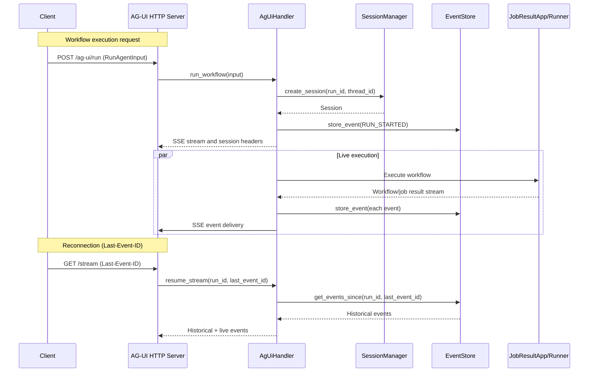

# AG-UI Front

An HTTP SSE server compliant with the AG-UI protocol for real-time streaming execution of jobworkerp-rs workflows.

> **Note:** This is an alpha version implemented by a coding agent. APIs and behavior may change without notice.

## Overview

AG-UI Front implements the [AG-UI protocol](https://docs.ag-ui.com/) and provides the following features:

- **Workflow Execution**: Execute jobworkerp-rs workflows via HTTP API
- **Real-time Streaming**: Event delivery via SSE (Server-Sent Events)
- **LLM Integration**: Integration with LLM_CHAT runner, streaming text output
- **Human-in-the-Loop (HITL)**: Pause and resume workflow/LLM tool calls
- **Session Management**: Session persistence with in-memory or Redis backend
- **Reconnection Support**: Prevent event loss with Last-Event-ID

## Architecture

```
┌─────────────┐     ┌──────────────────┐     ┌─────────────────┐
│   Client    │────>│  AG-UI Front     │────>│  jobworkerp-rs  │
│  (Browser/  │<────│  (HTTP SSE)      │<────│  (Workflow)     │
│   CLI)      │ SSE │                  │     │                 │
└─────────────┘     └──────────────────┘     └─────────────────┘
                            │
                    ┌───────┴───────┐
                    │               │
              ┌─────┴─────┐   ┌─────┴─────┐
              │ Session   │   │  Event    │
              │ Manager   │   │  Store    │
              │(Memory/   │   │(Memory/   │
              │ Redis)    │   │ Redis)    │
              └───────────┘   └───────────┘
```

## Module Structure

| Module | Description |
|--------|-------------|
| `config` | Server configuration (loading from environment variables) |
| `error` | Error types and HTTP status mapping |
| `events` | AG-UI event types, encoders, adapters |
| `events/adapter` | jobworkerp events → AG-UI events conversion |
| `events/encoder` | SSE format encoder |
| `events/llm` | LLM streaming result conversion, tool call extraction |
| `events/state_diff` | State diff via RFC 6902 JSON Patch |
| `events/types` | `AgUiEvent` enum and related utilities |
| `handler` | Core logic for workflow execution and HITL management |
| `pubsub` | LLM job result subscription and conversion |
| `server/auth` | Bearer Token authentication middleware |
| `server/http` | Axum HTTP server, routing, SSE |
| `session/manager` | Session management trait and in-memory implementation |
| `session/redis_manager` | Redis session management implementation |
| `session/store` | Event store trait and in-memory implementation |
| `session/redis_store` | Redis event store implementation |
| `types` | Input/output type definitions (Context, Message, Tool, etc.) |

## Environment Variables

| Variable | Default | Description |
|----------|---------|-------------|
| `AG_UI_BIND_ADDR` | `0.0.0.0:8080` | Server bind address |
| `AG_UI_AUTH_TOKENS` | (none) | Comma-separated authentication tokens |
| `AG_UI_SESSION_TTL_SEC` | `3600` | Session TTL (seconds) |
| `AG_UI_MAX_EVENTS_PER_SESSION` | `1000` | Maximum events per session |
| `STORAGE_TYPE` | `Standalone` | `Standalone` or `Scalable` |
| `REDIS_URL` | (none) | Redis URL (for Scalable mode) |

## API Endpoints

| Endpoint | Method | Description |
|----------|--------|-------------|
| `/api/health` | GET | Health check |
| `/ag-ui/run` | POST | Start workflow execution (returns SSE stream) |
| `/ag-ui/stream/{run_id}` | GET | Reconnect to existing execution stream |
| `/ag-ui/message` | POST | Send HITL message (tool results) |
| `/ag-ui/run/{run_id}` | DELETE | Cancel workflow |
| `/ag-ui/state/{run_id}` | GET | Get workflow state |

See the [Client Guide](docs/CLIENT_GUIDE.md) for details.

## SSE Events

### Lifecycle Events

| Event | Description |
|-------|-------------|
| `RUN_STARTED` | Workflow started |
| `RUN_FINISHED` | Workflow completed successfully |
| `RUN_ERROR` | Workflow ended with error |
| `STEP_STARTED` | Task started |
| `STEP_FINISHED` | Task finished |

### Message Events (LLM Streaming)

| Event | Description |
|-------|-------------|
| `TEXT_MESSAGE_START` | Message start |
| `TEXT_MESSAGE_CONTENT` | Message content (delta) |
| `TEXT_MESSAGE_END` | Message end |

### Tool Call Events

| Event | Description |
|-------|-------------|
| `TOOL_CALL_START` | Tool call start |
| `TOOL_CALL_ARGS` | Tool arguments (delta) |
| `TOOL_CALL_END` | Tool call end |
| `TOOL_CALL_RESULT` | Tool execution result |

### State Events

| Event | Description |
|-------|-------------|
| `STATE_SNAPSHOT` | State snapshot |
| `STATE_DELTA` | State delta (RFC 6902 JSON Patch) |

## HITL (Human-in-the-Loop)

AG-UI Front supports two types of HITL:

### 1. Workflow HITL

Pauses at tasks with `checkpoint: true` set in the workflow and waits for user input.
Use the `/ag-ui/message` endpoint to resume from checkpoints.

### 2. LLM Tool Calling HITL

When `isAutoCalling: false` is set in the LLM_CHAT runner, the workflow pauses when the LLM requests a tool call.

**Flow:**

```
Client                         AG-UI Server                    LLM
   |                              |                             |
   |-- POST /ag-ui/run ---------->|                             |
   |                              |-- Execute LLM_CHAT -------->|
   |                              |<-- Tool call request -------|
   |<-- TOOL_CALL_START ----------|   (pending_tool_calls)      |
   |<-- TOOL_CALL_ARGS -----------|                             |
   |   (Stream paused)            |                             |
   |                              |                             |
   |   [User approves tool]       |                             |
   |                              |                             |
   |-- POST /ag-ui/message ------>|                             |
   |   (toolCallResults)          |                             |
   |<-- TOOL_CALL_RESULT ---------|                             |
   |<-- TOOL_CALL_END ------------|                             |
   |<-- RUN_FINISHED -------------|                             |
   |                              |                             |
   |   [Client sends follow-up    |                             |
   |    with tool result in       |                             |
   |    messages]                 |                             |
   |                              |                             |
   |-- POST /ag-ui/run ---------->|                             |
   |   (messages with TOOL role)  |-- Execute LLM_CHAT -------->|
   |                              |   (with tool result)        |
   |<-- TEXT_MESSAGE_* -----------|<-- LLM response ------------|
```

**Tool Name Format:**

LLM tool call `toolCallName` follows the format `RUNNER___method`, where the runner name and method name are concatenated with triple underscores.
Examples: `COMMAND___run`, `HTTP_REQUEST___get`

It is recommended to convert to `/` separator for client display.

## Usage

### Starting the Server

```bash
# Set environment variables
export AG_UI_BIND_ADDR=0.0.0.0:8080
export AG_UI_AUTH_TOKENS=secret-token-1,secret-token-2

# Start
cargo run --bin ag_ui_http
```

### Client Implementation

See the following for client implementation details:

- [Client Guide (English)](docs/CLIENT_GUIDE.md)
- [Client Guide (Japanese)](docs/CLIENT_GUIDE_ja.md)

## Sequence Diagram



## License

Follows the jobworkerp-rs project license.
