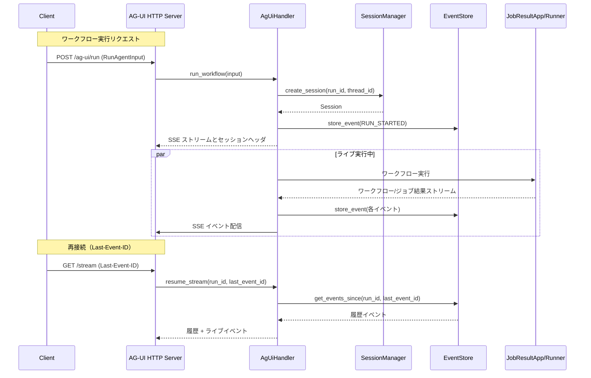

# AG-UI Front

AG-UI プロトコルに準拠した HTTP SSE サーバーで、jobworkerp-rs ワークフローをリアルタイムにストリーミング実行します。

> **注意:** 本モジュールは coding agent が実装したアルファ版です。API や動作は予告なく変更される可能性があります。

## 概要

AG-UI Front は [AG-UI プロトコル](https://docs.ag-ui.com/) を実装し、以下の機能を提供します：

- **ワークフロー実行**: jobworkerp-rs ワークフローの HTTP API 経由での実行
- **リアルタイムストリーミング**: SSE (Server-Sent Events) によるイベント配信
- **LLM 統合**: LLM_CHAT ランナーとの統合、ストリーミングテキスト出力
- **Human-in-the-Loop (HITL)**: ワークフロー/LLM ツール呼び出しの一時停止と再開
- **セッション管理**: インメモリまたは Redis バックエンドでのセッション永続化
- **再接続サポート**: Last-Event-ID によるイベント欠落防止

## アーキテクチャ

```
┌─────────────┐     ┌──────────────────┐     ┌─────────────────┐
│   Client    │────>│  AG-UI Front     │────>│  jobworkerp-rs  │
│  (Browser/  │<────│  (HTTP SSE)      │<────│  (Workflow)     │
│   CLI)      │ SSE │                  │     │                 │
└─────────────┘     └──────────────────┘     └─────────────────┘
                            │
                    ┌───────┴───────┐
                    │               │
              ┌─────┴─────┐   ┌─────┴─────┐
              │ Session   │   │  Event    │
              │ Manager   │   │  Store    │
              │(Memory/   │   │(Memory/   │
              │ Redis)    │   │ Redis)    │
              └───────────┘   └───────────┘
```

## モジュール構成

| モジュール | 説明 |
|-----------|------|
| `config` | サーバー設定（環境変数からの読み込み） |
| `error` | エラー型とHTTPステータスマッピング |
| `events` | AG-UI イベント型、エンコーダー、アダプター |
| `events/adapter` | jobworkerp イベント → AG-UI イベント変換 |
| `events/encoder` | SSE フォーマットエンコーダー |
| `events/llm` | LLM ストリーミング結果の変換、ツール呼び出し抽出 |
| `events/state_diff` | RFC 6902 JSON Patch による状態差分 |
| `events/types` | `AgUiEvent` 列挙型と関連ユーティリティ |
| `handler` | ワークフロー実行、HITL 管理のコアロジック |
| `pubsub` | LLM ジョブ結果の購読と変換 |
| `server/auth` | Bearer Token 認証ミドルウェア |
| `server/http` | Axum HTTP サーバー、ルーティング、SSE |
| `session/manager` | セッション管理トレイト、インメモリ実装 |
| `session/redis_manager` | Redis セッション管理実装 |
| `session/store` | イベントストアトレイト、インメモリ実装 |
| `session/redis_store` | Redis イベントストア実装 |
| `types` | 入力/出力型定義（Context, Message, Tool 等） |

## 環境変数

| 変数名 | デフォルト | 説明 |
|--------|-----------|------|
| `AG_UI_BIND_ADDR` | `0.0.0.0:8080` | サーバーバインドアドレス |
| `AG_UI_AUTH_TOKENS` | (なし) | カンマ区切りの認証トークン |
| `AG_UI_SESSION_TTL_SEC` | `3600` | セッション TTL（秒） |
| `AG_UI_MAX_EVENTS_PER_SESSION` | `1000` | セッション毎の最大イベント数 |
| `STORAGE_TYPE` | `Standalone` | `Standalone` または `Scalable` |
| `REDIS_URL` | (なし) | Redis URL（Scalable モード時） |

## API エンドポイント

| エンドポイント | メソッド | 説明 |
|---------------|---------|------|
| `/api/health` | GET | ヘルスチェック |
| `/ag-ui/run` | POST | ワークフロー実行開始（SSE ストリーム返却） |
| `/ag-ui/stream/{run_id}` | GET | 既存実行へのストリーム再接続 |
| `/ag-ui/message` | POST | HITL メッセージ送信（ツール結果） |
| `/ag-ui/run/{run_id}` | DELETE | ワークフローキャンセル |
| `/ag-ui/state/{run_id}` | GET | ワークフロー状態取得 |

詳細は [クライアント利用ガイド](docs/CLIENT_GUIDE_ja.md) を参照してください。

## SSE イベント一覧

### ライフサイクルイベント

| イベント | 説明 |
|---------|------|
| `RUN_STARTED` | ワークフロー開始 |
| `RUN_FINISHED` | ワークフロー正常終了 |
| `RUN_ERROR` | ワークフローエラー終了 |
| `STEP_STARTED` | タスク開始 |
| `STEP_FINISHED` | タスク終了 |

### メッセージイベント（LLM ストリーミング）

| イベント | 説明 |
|---------|------|
| `TEXT_MESSAGE_START` | メッセージ開始 |
| `TEXT_MESSAGE_CONTENT` | メッセージ内容（デルタ） |
| `TEXT_MESSAGE_END` | メッセージ終了 |

### ツール呼び出しイベント

| イベント | 説明 |
|---------|------|
| `TOOL_CALL_START` | ツール呼び出し開始 |
| `TOOL_CALL_ARGS` | ツール引数（デルタ） |
| `TOOL_CALL_END` | ツール呼び出し終了 |
| `TOOL_CALL_RESULT` | ツール実行結果 |

### 状態イベント

| イベント | 説明 |
|---------|------|
| `STATE_SNAPSHOT` | 状態スナップショット |
| `STATE_DELTA` | 状態差分（RFC 6902 JSON Patch） |

## HITL（Human-in-the-Loop）

AG-UI Front は2種類の HITL をサポートします：

### 1. ワークフロー HITL

ワークフロー内で `checkpoint: true` を設定したタスクで一時停止し、ユーザー入力を待機します。
チェックポイントからの再開には `/ag-ui/message` エンドポイントを使用します。

### 2. LLM ツール呼び出し HITL

LLM_CHAT ランナーで `isAutoCalling: false` を設定すると、LLM がツール呼び出しを要求した際にワークフローが一時停止します。

**フロー:**

```
Client                         AG-UI Server                    LLM
   |                              |                             |
   |-- POST /ag-ui/run ---------->|                             |
   |                              |-- LLM_CHAT 実行 ----------->|
   |                              |<-- ツール呼び出し要求 -------|
   |<-- TOOL_CALL_START ----------|   (pending_tool_calls)      |
   |<-- TOOL_CALL_ARGS -----------|                             |
   |   (ストリーム一時停止)        |                             |
   |                              |                             |
   |   [ユーザーがツールを承認]    |                             |
   |                              |                             |
   |-- POST /ag-ui/message ------>|                             |
   |   (toolCallResults)          |                             |
   |<-- TOOL_CALL_RESULT ---------|                             |
   |<-- TOOL_CALL_END ------------|                             |
   |<-- RUN_FINISHED -------------|                             |
   |                              |                             |
   |   [クライアントがツール結果を|                             |
   |    含めて新規リクエスト送信] |                             |
   |                              |                             |
   |-- POST /ag-ui/run ---------->|                             |
   |   (messages に TOOL ロール)  |-- LLM_CHAT 実行 ----------->|
   |                              |   (ツール結果を含む)        |
   |<-- TEXT_MESSAGE_* -----------|<-- LLM 応答 ----------------|
```

**ツール名の形式:**

LLM ツール呼び出しの `toolCallName` は `RUNNER___method` の形式で、ランナー名とメソッド名がトリプルアンダースコアで連結されています。
例: `COMMAND___run`, `HTTP_REQUEST___get`

クライアント表示時は `/` 区切りに変換することを推奨します。

## 使用例

### サーバー起動

```bash
# 環境変数設定
export AG_UI_BIND_ADDR=0.0.0.0:8080
export AG_UI_AUTH_TOKENS=secret-token-1,secret-token-2

# 起動
cargo run --bin ag_ui_http
```

### クライアント実装

クライアント実装の詳細は以下を参照してください：

- [クライアント利用ガイド（英語）](docs/CLIENT_GUIDE.md)
- [クライアント利用ガイド（日本語）](docs/CLIENT_GUIDE_ja.md)

## シーケンス図



## ライセンス

jobworkerp-rs プロジェクトのライセンスに従います。
