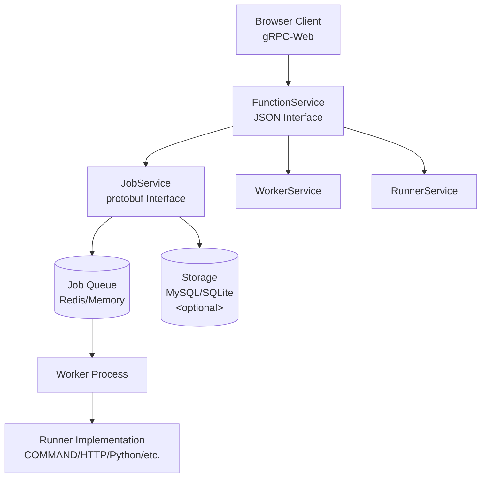

# gRPC-Web Function Interface Usage Guide

## Overview

jobworkerp-rs provides a gRPC-Web compatible `FunctionService` interface for browser-based web clients. This interface allows browsers to directly handle runner settings, arguments, and results in JSON format.

## Architecture and Concepts

### Position of Function Service

`FunctionService` acts as a high-level wrapper around jobworkerp-rs's core `JobService`, designed to facilitate access from browsers.



### The Function Concept and Relationship with Jobs

#### 1. What is a Function?
- **Function**: A unified interface that makes Runners (execution engines) or Workers (pre-configured jobs) executable in JSON format
- **Job**: The actual processing unit. Created internally from a Function and executed by the Worker Process

#### 2. Execution Flow

**When specifying a Runner (`runner_name`):**
1. `FunctionService.Call()` → Creates a temporary Worker internally
2. Enqueues a Job using the Worker (`JobService.Enqueue`)
3. Worker Process retrieves and executes the job
4. Returns results via streaming

**When specifying a Worker (`worker_name`):**
1. `FunctionService.Call()` → Uses an existing Worker
2. Enqueues a Job and Worker executes the job
3. Returns results via streaming

#### 3. Performance Considerations

**When executing Runner directly:**
- **Pros**: Configuration flexibility, ideal for one-time executions
- **Cons**: Overhead of creating a Worker each time

**When creating a Worker in advance:**
- **Pros**: High throughput, reuse of pre-configured execution environment
- **Cons**: Requires prior configuration

**Recommendations:**
- **High frequency / large volume**: Create a Worker in advance and execute with `worker_name`
- **One-time / frequently changing configuration**: Execute directly with `runner_name`
- **Runners with high initialization cost**: Consider setting `use_static=true` on the Worker

### Streaming Support

Functions always return streaming responses due to the nature of asynchronous job execution:

1. **Execution start**: Job is enqueued, initial response containing `job_id`
2. **Progress**: Real-time output depending on the runner (e.g., long-running command execution)
3. **Completion**: Final result and execution metadata (`FunctionExecutionInfo`)

### Internal Execution Details

Internal behavior of `FunctionService.Call()`:

```rust
// When executing by Runner name
async fn handle_runner_for_front() {
    // 1. Find Runner by name
    let runner = find_runner_by_name(runner_name);

    // 2. Create temporary Worker data
    let worker_data = create_worker_data(runner, runner_settings, worker_options);

    // 3. Enqueue Job (equivalent to JobService.Enqueue)
    let (job_id, job_result, stream) = setup_worker_and_enqueue_with_json_full_output();

    // 4. Stream results in FunctionResult format
    return process_job_result_to_stream();
}
```

This design hides complex internal processing, making it easy to use jobworkerp-rs features from browser clients.

## Function Service Feature Overview

`FunctionService` provides the following main features:

- **Function search and discovery**: Search for runners and workers
- **Function invocation**: Asynchronous job execution via JSON payload
- **Streaming support**: Real-time result retrieval

## protobuf Definitions

### Service Definition

```proto
service FunctionService {
  // Retrieve list of available Functions (streaming)
  rpc FindList(FindFunctionRequest)
    returns (stream FunctionSpecs);

  // Retrieve list of Functions by FunctionSet
  rpc FindListBySet(FindFunctionSetRequest)
    returns (stream FunctionSpecs);

  // Execute Function (streaming results)
  rpc Call(FunctionCallRequest)
    returns (stream FunctionResult);

  // Find Function by FunctionUsing (FunctionId + optional using)
  rpc Find(FunctionUsing)
    returns (OptionalFunctionSpecsResponse);

  // Find Function by name
  rpc FindByName(FindFunctionByNameRequest)
    returns (OptionalFunctionSpecsResponse);

  // Create a Worker from any Runner with detailed configuration
  rpc CreateWorker(CreateWorkerRequest)
    returns (CreateWorkerResponse);

  // Create a REUSABLE_WORKFLOW Worker from workflow definition
  rpc CreateWorkflow(CreateWorkflowRequest)
    returns (CreateWorkflowResponse);
}
```

### Key Messages

#### FunctionCallRequest (Important)

```proto
message FunctionCallRequest {
  // Name of execution target
  oneof name {
    string runner_name = 1;    // Runner name
    string worker_name = 2;    // Worker name
  }

  // Runner parameters (only when runner_name is specified)
  optional RunnerParameters runner_parameters = 3;

  // Job arguments (JSON format)
  string args_json = 4;

  // Duplicate execution prevention key
  optional string uniq_key = 5;

  // Execution options
  optional FunctionCallOptions options = 6;
}
```

#### RunnerParameters

```proto
message RunnerParameters {
  // Runner settings (JSON format)
  string settings_json = 1;

  // Worker options
  WorkerOptions worker_options = 2;
}
```

#### FunctionResult

```proto
message FunctionResult {
  // Execution result (JSON format)
  string output = 1;

  // Execution status
  optional ResultStatus status = 2;

  // Error message
  optional string error_message = 3;

  // Error code
  optional string error_code = 4;

  // Execution info (at end of stream)
  optional FunctionExecutionInfo last_info = 5;
}
```

## gRPC-Web Client Implementation Examples

### 1. Basic Connection Setup

```typescript
import { FunctionServiceClient } from './generated/jobworkerp/function/service/function_grpc_web_pb';
import { FunctionCallRequest, FindFunctionRequest } from './generated/jobworkerp/function/service/function_pb';

const client = new FunctionServiceClient('http://localhost:8080', null, null);
```

### 2. Retrieving Function List

```typescript
async function listFunctions() {
  const request = new FindFunctionRequest();
  request.setExcludeRunner(false);
  request.setExcludeWorker(false);

  const stream = client.findList(request);

  stream.on('data', (response) => {
    console.log('Function:', response.getName());
    console.log('Description:', response.getDescription());
    console.log('Runner Type:', response.getRunnerType());
  });

  stream.on('end', () => {
    console.log('Function list completed');
  });

  stream.on('error', (err) => {
    console.error('Error:', err);
  });
}
```

### 3. Function Execution (Runner)

```typescript
async function callRunner() {
  const request = new FunctionCallRequest();
  request.setRunnerName('command');

  // Set runner parameters
  const runnerParams = new RunnerParameters();
  runnerParams.setSettingsJson(JSON.stringify({
    // Runner-specific settings
  }));

  const workerOptions = new WorkerOptions();
  workerOptions.setStoreSuccess(true);
  workerOptions.setStoreFailure(true);
  runnerParams.setWorkerOptions(workerOptions);

  request.setRunnerParameters(runnerParams);

  // Job arguments (JSON format)
  request.setArgsJson(JSON.stringify({
    command: 'echo "Hello World"'
  }));

  request.setUniqKey('unique-job-' + Date.now());

  const stream = client.call(request);

  stream.on('data', (result) => {
    console.log('Output:', result.getOutput());
    console.log('Status:', result.getStatus());

    if (result.getLastInfo()) {
      console.log('Job ID:', result.getLastInfo().getJobId());
      console.log('Execution Time:', result.getLastInfo().getExecutionTimeMs());
    }
  });

  stream.on('end', () => {
    console.log('Job execution completed');
  });

  stream.on('error', (err) => {
    console.error('Execution error:', err);
  });
}
```

### 4. Function Execution (Worker)

```typescript
async function callWorker() {
  const request = new FunctionCallRequest();
  request.setWorkerName('my-worker');

  // Specify only job arguments (worker settings are pre-defined)
  request.setArgsJson(JSON.stringify({
    input: 'processing data'
  }));

  const stream = client.call(request);

  stream.on('data', (result) => {
    try {
      const output = JSON.parse(result.getOutput());
      console.log('Processing result:', output);
    } catch (e) {
      console.log('Raw output:', result.getOutput());
    }
  });

  stream.on('end', () => {
    console.log('Worker execution completed');
  });
}
```

## Configuration and Deployment

### Server Configuration

To start a gRPC-Web compatible server, set the following environment variables:

```env
# Enable gRPC-Web
USE_GRPC_WEB=true

# Other related settings
MAX_FRAME_SIZE=16777215  # 16MB - 1
GRPC_ADDR=0.0.0.0:9000
```

### Starting the Server

```bash
# Start gRPC-Web compatible server
# Launch with USE_GRPC_WEB=true environment variable
USE_GRPC_WEB=true ./target/release/grpc-front
```

## Available Runner Types

The following Runner Types are available:

### COMMAND - Shell Command Execution

**Runner Settings (settings_json):**
```json
{}
```

**Job Arguments (args_json):**
```json
{
  "command": "echo",
  "args": ["Hello", "World"],
  "with_memory_monitoring": false
}
```

### HTTP_REQUEST - HTTP Request Execution

**Runner Settings (settings_json):**
```json
{
  "base_url": "https://api.example.com"
}
```

**Job Arguments (args_json):**
```json
{
  "method": "GET",
  "path": "/users/123",
  "headers": [
    {"key": "Content-Type", "value": "application/json"},
    {"key": "Authorization", "value": "Bearer token"}
  ],
  "queries": [
    {"key": "page", "value": "1"},
    {"key": "limit", "value": "10"}
  ],
  "body": "{\"name\": \"example\"}"
}
```

### PYTHON_COMMAND - Python Script Execution

**Runner Settings (settings_json):**
```json
{
  "python_version": "3.11",
  "uv_path": "/usr/bin/uv",
  "packages": {
    "list": ["requests", "pandas", "numpy"]
  }
}
```

**Job Arguments (args_json):**
```json
{
  "script_content": "import sys\nprint('Hello from Python!')\nprint(f'Arguments: {sys.argv[1:]}')",
  "env_vars": {
    "MY_VAR": "example_value"
  },
  "data_body": "input data for script",
  "with_stderr": true
}
```

### DOCKER - Docker Container Execution

**Runner Settings (settings_json):**
```json
{
  "from_image": "python:3.11-slim",
  "tag": "latest",
  "env": ["PYTHONPATH=/app"],
  "working_dir": "/app",
  "volumes": ["/tmp"],
  "entrypoint": ["python"]
}
```

**Job Arguments (args_json):**
```json
{
  "cmd": ["-c", "print('Hello from Docker!')"],
  "env": ["DEBUG=1"],
  "working_dir": "/workspace",
  "user": "1000:1000"
}
```

### GRPC - gRPC Request (Multi-method)

A multi-method runner supporting both unary and server streaming gRPC calls.

**Runner Settings (settings_json):**
```json
{
  "host": "localhost",
  "port": 9090,
  "tls": false,
  "timeout_ms": 30000,
  "use_reflection": true
}
```

**Job Arguments (args_json) - Unary (using: "unary", default):**
```json
{
  "method": "example.v1.ExampleService/GetUser",
  "request": "{\"user_id\": \"123\"}",
  "metadata": {
    "authorization": "Bearer token"
  },
  "timeout": 10000
}
```

**Job Arguments (args_json) - Server Streaming (using: "streaming"):**
```json
{
  "method": "example.v1.ExampleService/ListUsers",
  "request": "{\"page_size\": 10}",
  "metadata": {
    "authorization": "Bearer token"
  },
  "timeout": 30000
}
```

### LLM - LLM Text Generation / Chat

**Runner Settings (settings_json) - Ollama:**
```json
{
  "ollama": {
    "base_url": "http://localhost:11434",
    "model": "llama3.2",
    "system_prompt": "You are a helpful assistant.",
    "pull_model": true
  }
}
```

**Job Arguments (args_json) - For Ollama completion:**
```json
{
  "prompt": "Write a short story about a robot.",
  "options": {
    "max_tokens": 1000,
    "temperature": 0.7,
    "top_p": 0.9
  }
}
```

**Runner Settings (settings_json) - GenAI:**
```json
{
  "genai": {
    "model": "gpt-4o-mini",
    "system_prompt": "You are a helpful assistant."
  }
}
```

**Job Arguments (args_json) - For GenAI chat (using `chat` method):**
```json
{
  "messages": [
    {"role": "USER", "content": {"text": "Write a short story about a robot."}}
  ],
  "options": {
    "max_tokens": 1000,
    "temperature": 0.7
  },
  "function_options": {
    "use_function_calling": true,
    "use_runners_as_function": true
  }
}
```

### MCP_SERVER - MCP Server Tool Execution

**Runner Settings (settings_json):**
MCP server settings are defined in the `mcp-settings.toml` file.

**Job Arguments (args_json):**
```json
{
  "tool_name": "fetch",
  "arg_json": "{\"url\": \"https://api.example.com/data\", \"method\": \"GET\"}"
}
```

> **Note**: Method selection (`"completion"`/`"chat"`) is specified via `JobRequest.using` when using gRPC directly. When calling through FunctionService.Call, the method can be specified by using the `runner_name___method_name` format (triple underscore delimiter), e.g., `llm___chat`. If not specified, the default `run` method is executed.

### FUNCTION_SET_SELECTOR - FunctionSet Listing (Internal)

An internal runner used by LLM AutoSelection functionality. Lists available FunctionSets with tool summaries. This is not typically used directly by users.

### WORKFLOW - Workflow Execution

The WORKFLOW runner is a multi-method runner. The execution method (`run` or `create`) is specified via `JobRequest.using` when using gRPC directly, or via the `runner_name___method_name` format (e.g., `workflow___run`) when using FunctionService.Call.

**Inline execution (using: "run"):**

**Runner Settings (settings_json):**
```json
{}
```

**Job Arguments (args_json):**
```json
{
  "workflow_data": "{\"document\": {\"dsl\": \"1.0.0-alpha\", \"namespace\": \"examples\", \"name\": \"hello-world\", \"version\": \"1.0.0\"}, \"do\": [{\"call\": \"http\", \"with\": {\"method\": \"get\", \"endpoint\": {\"uri\": \"https://api.example.com/hello\"}}}]}",
  "input": "{\"name\": \"World\"}",
  "workflow_context": "{\"timeout\": 30000}"
}
```

**Create reusable workflow Worker (using: "create"):**

**Runner Settings (settings_json):**
```json
{}
```

**Job Arguments (args_json):**
```json
{
  "workflow_url": "./data-processing-workflow.yaml",
  "name": "data-processing-workflow"
}
```

### PLUGIN - Custom Plugin

**Runner Settings (settings_json):**
Plugin-specific settings (depends on plugin implementation)

**Job Arguments (args_json):**
Plugin-specific arguments (depends on plugin implementation)

## Error Handling

```typescript
stream.on('error', (err) => {
  console.error('gRPC Error:', err.code, err.message);

  switch (err.code) {
    case grpc.StatusCode.INVALID_ARGUMENT:
      console.error('Invalid arguments provided');
      break;
    case grpc.StatusCode.NOT_FOUND:
      console.error('Function not found');
      break;
    case grpc.StatusCode.UNAVAILABLE:
      console.error('Service unavailable');
      break;
    default:
      console.error('Unexpected error');
  }
});
```

## Best Practices

### 1. Appropriate Timeout Configuration

```typescript
const options = new FunctionCallOptions();
options.setTimeoutMs(30000); // 30 seconds
request.setOptions(options);
```

### 2. Preventing Duplicate Execution

Set a unique key for jobs that need to prevent duplicate execution.

```typescript
request.setUniqKey(`job-uniq-task-${userId}`);
```

### 3. Proper Resource Management

```typescript
// Proper stream cleanup
const stream = client.call(request);
const controller = new AbortController();

// End stream on timeout
setTimeout(() => {
  controller.abort();
  stream.cancel();
}, 60000);
```

### 4. Parsing Result JSON

```typescript
stream.on('data', (result) => {
  try {
    const parsedOutput = JSON.parse(result.getOutput());
    // Process parsed result
    handleStructuredOutput(parsedOutput);
  } catch (e) {
    // Process as raw text output
    handleRawOutput(result.getOutput());
  }
});
```

## Reference Links

- [gRPC-Web Official Documentation](https://github.com/grpc/grpc-web)
- [jobworkerp-rs Configuration Documentation](configuration.md)
- [protobuf Schema Definitions](https://github.com/jobworkerp-rs/jobworkerp-rs/tree/main/proto/protobuf/jobworkerp/function/)
