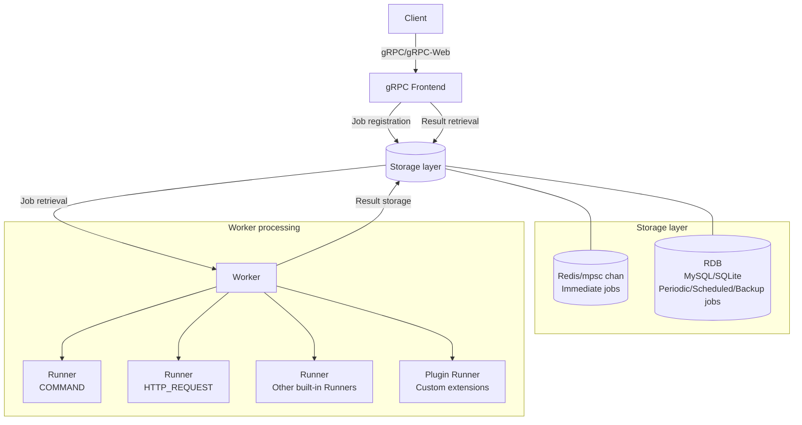

# jobworkerp-rs

## Overview

jobworkerp-rs is a scalable job worker system implemented in Rust.
The job worker system is used to process CPU-intensive, I/O-intensive, and long-running tasks asynchronously in the background.
Using gRPC, you can define [Workers](https://github.com/jobworkerp-rs/jobworkerp-rs/blob/main/proto/protobuf/jobworkerp/service/worker.proto), register [Jobs](https://github.com/jobworkerp-rs/jobworkerp-rs/blob/main/proto/protobuf/jobworkerp/service/job.proto) for task execution, and retrieve execution results.
Per-channel parallelism control and scheduled execution allow you to distribute and schedule system resource load.
Processing capabilities can be extended through plugins.
It also provides [Serverless Workflow](https://serverlessworkflow.io/)-based [workflow execution](workflow.md) with LLM integration and streaming support, [MCP proxy](runners/mcp-proxy.md) for using external MCP server tools as Runners, and an MCP server mode that exposes Workers as MCP tools to external LLM applications.

## Architecture Overview

jobworkerp-rs consists of the following main components:

- **gRPC Frontend**: An interface that accepts requests from clients and handles job registration/retrieval
- **Worker**: The component that performs the actual job processing, configurable with multiple channels and parallelism settings
- **Storage**: Two modes available — Standalone (single instance) / Scalable (multiple instances)
  - **Standalone**: In-memory channels for immediate jobs, RDB (SQLite/MySQL) for periodic/scheduled jobs
  - **Scalable**: Redis for immediate jobs, RDB (MySQL) for periodic/scheduled jobs with distributed processing

### Main Features

#### Job Management Features
- Storage options for job queues: Choose between Redis and RDB (MySQL or SQLite) based on requirements
- Retry functionality for failed jobs: Configure retry count and intervals (Exponential backoff and others)
- Scheduled execution at specific times

#### Result Retrieval and Notification
- Two methods for retrieving job execution results: Direct retrieval (DIRECT), No result retrieval (NO_RESULT)
- Real-time result notification (broadcast_results): Result distribution to multiple clients, streaming retrieval (See [Streaming](streaming.md) for details)

#### Execution Environment and Scalability
- Job execution channel configuration with parallel execution settings per channel
  - For example, you can set GPU channel to execute with parallelism of 1, while normal channel executes with parallelism of 4
  - Each worker server can process jobs with specified channels and parallelism, allowing adjustment of job execution servers and parallelism

#### Extensibility
- Extensible job execution content (Runner) through plugins
- Model Context Protocol (MCP) proxy functionality: Access LLMs and various tools provided by MCP servers through Runners
- LLM integration: Text generation and chat with tool calling support (See [LLM](llm.md) for details)
- Workflow functionality: Execute multiple jobs in coordination (See [Workflow](workflow.md) for details)
