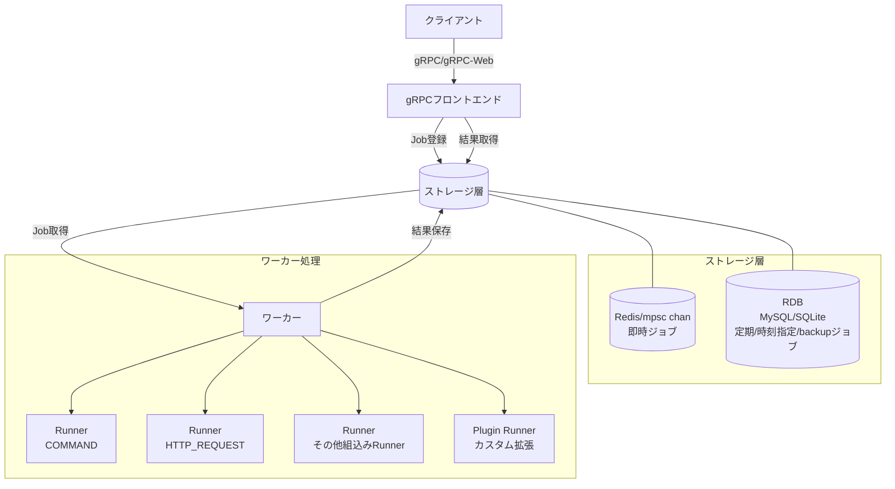

# jobworkerp-rs

## 概要

jobworkerp-rs は、Rustで実装されたスケーラブルなジョブワーカーシステム。
ジョブワーカーシステムは、CPU負荷やI/O負荷の高いタスク、長時間かかるタスクをバックグラウンドで非同期に処理するために利用する。
gRPCをつかって処理内容となる[Worker](https://github.com/jobworkerp-rs/jobworkerp-rs/blob/main/proto/protobuf/jobworkerp/service/worker.proto)の定義・処理実行のための[Job](https://github.com/jobworkerp-rs/jobworkerp-rs/blob/main/proto/protobuf/jobworkerp/service/job.proto)の登録、実行結果の取得などを実行できる。
チャンネルごとの並列度制御や時刻指定実行により、システムリソースへの負荷を分散・スケジュールできる。
プラグイン形式で処理を拡張できる。
また、[Serverless Workflow](https://serverlessworkflow.io/)ベースの[ワークフロー実行](workflow.md)（LLM統合・ストリーミング対応）、外部MCPサーバーのツールをRunnerとして利用する[MCPプロキシ](runners/mcp-proxy.md)、Workerを外部LLMアプリケーションにMCPツールとして公開するMCPサーバーモードをオプションとして提供する。

## アーキテクチャ概要

jobworkerp-rsは以下の主要コンポーネントで構成されている：

- **gRPC フロントエンド**: クライアントからのリクエストを受け付け、ジョブの登録・取得を行うインターフェース
- **ワーカー**: 実際のジョブ処理を行うコンポーネント、複数のチャンネルと並列度の設定が可能
- **ストレージ**: Standalone（単一インスタンス）/ Scalable（複数インスタンス）の2モードから選択
  - **Standalone**: 即時ジョブはメモリ内チャンネル、定期/時刻指定ジョブはRDB（SQLite/MySQL）
  - **Scalable**: 即時ジョブはRedis、定期/時刻指定ジョブはRDB（MySQL）で分散処理に対応

### 主な機能

#### ジョブ管理機能
- ジョブキューとして利用できるストレージ: ジョブに対する要求仕様に応じてmemory（Redis）、RDB（MySQLまたはSQLite）を使いわけられる
- ジョブ実行失敗時のリトライ機能: リトライ回数や間隔の設定（Exponential backoff 他）
- 指定時刻実行が可能

#### 結果取得と通知
- 2種類のジョブ実行結果の取得方法: 直接取得（DIRECT）、結果取得しない（NO_RESULT）
- リアルタイム結果通知機能（broadcast_results）: 複数クライアントへの結果配信、ストリーミング取得（詳細は[ストリーミング](streaming.md)を参照）

#### 実行環境とスケーラビリティ
- ジョブ実行チャネルの設定とチャネル毎の並列実行数の設定
  - 例えば、GPUチャネルでは並列度1で実行、通常チャネルでは並列度4で実行などの設定が可能
  - 各ワーカーサーバではチャンネルと並列度を指定してジョブ処理できるので、ジョブの実行サーバと並列度を調整可能

#### 拡張機能
- プラグインによる実行ジョブ機能（Runner）の拡張
- Model Context Protocol (MCP) プロキシ機能: MCPサーバーで提供されるLLMや各種ツールをRunner経由で利用可能
- LLM統合: テキスト生成やツール呼び出し付きチャット（詳細は[LLM](llm.md)を参照）
- ワークフロー機能: 複数のジョブを連携して実行（詳細は[ワークフロー](workflow.md)を参照）
