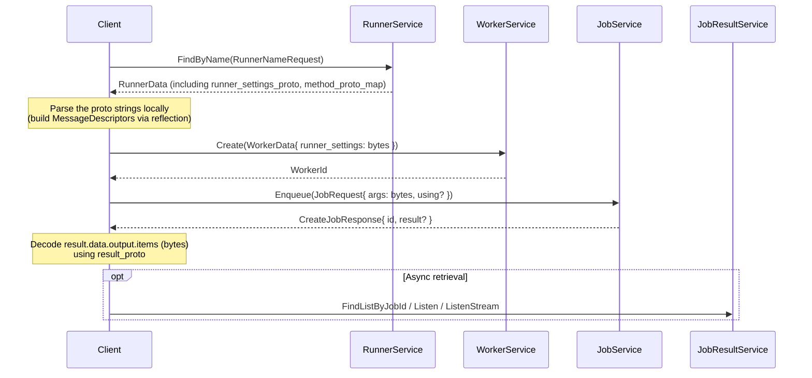

# Direct gRPC Usage (Protobuf Reflection)

## Overview — Two Client API Surfaces

jobworkerp-rs exposes two complementary client API surfaces.

| Aspect | `JobService.Enqueue*` direct | `FunctionService.Call` |
|--------|------------------------------|------------------------|
| Payload format | protobuf binary (`bytes`) | JSON string |
| Schema handling | Client-side reflection required | Server converts JSON → bytes |
| Wire efficiency | High (binary) | Medium (text-encoded) |
| Streaming | `EnqueueForStream` / `EnqueueWithClientStream` | `Call` returns a stream |
| Typical use | Backend-to-backend, CLI, server integrations | Browser (gRPC-Web), scripting |

This page covers the **former** — i.e. how to deal with protobuf reflection when calling `JobService.Enqueue*` directly. For the latter, see [Function](./function.md) and [gRPC-Web API](./grpc-web-api.md).

## Dynamic Schema Model — `bytes` Fields and Their Proto Strings

In `WorkerData` / `JobRequest` / `JobResultData`, every field whose type varies per Runner is a **`bytes` field carrying protobuf binary**. Clients must first fetch the corresponding **proto definition string** from `RunnerService`, build a descriptor locally via protobuf reflection, and then encode/decode through it.

| `bytes` field | Corresponding proto string |
|---------------|----------------------------|
| `WorkerData.runner_settings` | `RunnerData.runner_settings_proto` |
| `JobRequest.args` | `RunnerData.method_proto_map.schemas[using].args_proto` |
| `JobResultData.output.items` | `RunnerData.method_proto_map.schemas[using].result_proto` |
| `ResultOutputItem.data` / `final_collected` (streaming) | Same `result_proto` |

For multi-method Runners (LLM, WORKFLOW, MCP, Plugin), specify the key into `method_proto_map.schemas` (e.g. `"chat"`, `"run"`) via `JobRequest.using`. See "Multi-method Runners and `using`" below.



## Walkthrough — Minimal Flow with `grpcurl`

`grpc-front` enables gRPC reflection by default (`tonic_reflection`), so you can use generic tools such as `grpcurl` to discover services and send requests without extra setup.

### 0. Discovery

```bash
# Service list
grpcurl -plaintext localhost:9000 list

# RPCs and messages of a specific service
grpcurl -plaintext localhost:9000 list jobworkerp.service.RunnerService
grpcurl -plaintext localhost:9000 describe jobworkerp.service.JobRequest
```

### 1. Fetch RunnerData and extract proto strings

```bash
grpcurl -plaintext -d '{"name":"COMMAND"}' \
  localhost:9000 jobworkerp.service.RunnerService/FindByName \
  > runner.json
```

Excerpt of `runner.json`:

```json
{
  "data": {
    "id": { "value": "1" },
    "data": {
      "name": "COMMAND",
      "runnerType": "RUNNER_TYPE_COMMAND",
      "runnerSettingsProto": "syntax = \"proto3\";\nmessage CommandRunnerSettings { ... }",
      "methodProtoMap": {
        "schemas": {
          "run": {
            "argsProto": "syntax = \"proto3\";\nmessage CommandArgs { string command = 1; repeated string args = 2; ... }",
            "resultProto": "syntax = \"proto3\";\nmessage CommandResult { ... }",
            "outputType": "NON_STREAMING"
          }
        }
      }
    }
  }
}
```

Save `runnerSettingsProto` / `argsProto` / `resultProto` to local `.proto` files for later compilation/parsing. They are guaranteed to be **single-message, import-free** definitions (see [Plugin Development](./plugin-development.md)).

### 2. Build the args byte payload

`grpcurl`'s JSON input encodes `bytes` fields as **Base64 strings** (proto3 JSON Mapping spec). So you need a way to convert "structured data (JSON / YAML / …) → protobuf binary → Base64."

A generic option is `protoc --encode`:

```bash
# Save the argsProto extracted above into args.proto
echo 'CommandArgs { command: "echo" args: "hello" }' \
  | protoc --encode=CommandArgs args.proto \
  | base64 -w0 > args.b64
```

(In actual programs, encoding via a reflection library is more practical — see "Per-language Implementation Guide" below.)

### 3. Create a Worker

```bash
RUNNER_SETTINGS_B64=""   # COMMAND has no settings, leave empty
grpcurl -plaintext -d "$(cat <<EOF
{
  "name": "echo-worker",
  "description": "",
  "runnerId": { "value": "1" },
  "runnerSettings": "${RUNNER_SETTINGS_B64}",
  "responseType": "DIRECT",
  "storeSuccess": true,
  "storeFailure": true
}
EOF
)" localhost:9000 jobworkerp.service.WorkerService/Create
```

You get back a `WorkerId`.

### 4. Enqueue a Job

```bash
ARGS_B64=$(cat args.b64)
grpcurl -plaintext -d "$(cat <<EOF
{
  "workerId": { "value": "1234567890" },
  "args": "${ARGS_B64}"
}
EOF
)" localhost:9000 jobworkerp.service.JobService/Enqueue
```

For a Worker created with `responseType=DIRECT`, the response carries the result inline at `result.data.output.items` (Base64). Otherwise, retrieve it later via `JobResultService.FindListByJobId`.

### 5. Decode the result

Base64-decode `output.items` and parse the resulting bytes through the `resultProto` you saved in Step 1 to get a structured object back.

## Per-language Implementation Guide

Any protobuf reflection-capable library will work. The flow is identical across languages: **fetch proto strings via `RunnerService.FindByName`, parse them locally, encode/decode through descriptors.**

### Rust (generic pattern)

Suggested dependencies:

```toml
[dependencies]
prost = "0.14"
prost-reflect = "0.16"
tonic = "0.14"
tonic-prost-build = "0.14"
serde_json = "1"
```

Compile the proto strings into a `FileDescriptorSet` at runtime (e.g. via `tonic-prost-build` or by shelling out to `protoc -o`), load it with `prost_reflect::DescriptorPool::decode_file_descriptor_set`, then convert with `DynamicMessage::deserialize(descriptor, &serde_json::Value)` → `encode_to_vec()`. For decoding, use `DynamicMessage::decode(descriptor, bytes)` → `serde_json::to_value(&msg)`.

> **Easier alternative**: the official Rust client crate **[jobworkerp-client-rs](https://github.com/jobworkerp-rs/jobworkerp-client-rs)** ships helper APIs (e.g. `setup_worker_and_enqueue_with_json`) that already perform `RunnerService.FindByName` → descriptor build → JSON-to-bytes → `WorkerService.Create` → `JobService.Enqueue` → result JSON-ification. The CLI binary `jobworkerp-client` invokes the same path through `worker create --settings '{...}'` and `job enqueue --args '{...}'` (see [Client Usage](./client-usage.md)).

### TypeScript / Browser

Suggested dependencies:

```json
{
  "dependencies": {
    "protobufjs": "^7.5.4",
    "nice-grpc-web": "^3.3.9"
  }
}
```

`protobufjs` accepts a single proto string via `protobuf.parse(protoString).root` without needing imports, then `Type.encode(value).finish()` produces a `Uint8Array` and `Type.decode(bytes).toObject(...)` yields JSON. A small helper that returns the first message (`findFirstType`) pairs well with `runnerSettingsProto` / `argsProto` / `resultProto`, which always wrap a single top-level message.

Sketch:

```ts
import * as protobuf from "protobufjs";

const findFirstType = (ns: protobuf.NamespaceBase): protobuf.Type | null => {
  for (const nested of ns.nestedArray) {
    if (nested instanceof protobuf.Type) return nested;
    if (nested instanceof protobuf.Namespace) {
      const found = findFirstType(nested);
      if (found) return found;
    }
  }
  return null;
};

// Encode args
const root = protobuf.parse(argsProto).root;
const ArgsType = findFirstType(root)!;
const errMsg = ArgsType.verify(jobArgsJson);
if (errMsg) throw new Error(errMsg);
const argsBytes = ArgsType.encode(ArgsType.create(jobArgsJson)).finish();

// Build JobRequest and enqueue (via generated ts-proto / @bufbuild client)
const req = JobRequest.create({ workerId: { value: workerId }, args: argsBytes });
const res = await jobClient.enqueue(req);

// Decode the result
const resultRoot = protobuf.parse(resultProto).root;
const ResultType = findFirstType(resultRoot)!;
const decoded = ResultType.decode(res.result!.data!.output!.items);
const json = ResultType.toObject(decoded, { defaults: true, enums: String, longs: String });
```

> **Easier alternative**: the official admin UI **[admin-ui](https://github.com/jobworkerp-rs/admin-ui)** demonstrates this pattern end-to-end: `findFirstType` + `protobuf.parse` + `nice-grpc-web` clients calling `JobService` / `WorkerService` directly. See `src/pages/jobs/enqueue.tsx` for argument encoding and `src/pages/workers/edit.tsx` for two-way conversion of `runner_settings`.

When calling from a browser, server-streaming RPCs such as `EnqueueForStream` require a gRPC-Web-capable setup. See [gRPC-Web API](./grpc-web-api.md).

### Python (sketch only)

- Use `grpc_tools.protoc` to compile `runner_settings_proto` / `args_proto` / `result_proto` written to temp files at runtime
- Or build `FileDescriptorProto` dynamically via `google.protobuf.descriptor_pb2` and `descriptor_pool`
- Use `google.protobuf.json_format.Parse` / `MessageToJson` for JSON ⇄ message conversion, then `SerializeToString()` for bytes

### Go (sketch only)

- Use `github.com/jhump/protoreflect/desc/protoparse` to parse the proto string into a `desc.MessageDescriptor`
- Use `github.com/jhump/protoreflect/dynamic` (`dynamic.NewMessage(md)`) with `UnmarshalJSON` / `Marshal` for bidirectional conversion

### Common note

`runner_settings_proto` / `args_proto` / `result_proto` are **single-message, import-free** definitions ([Plugin Development](./plugin-development.md) explains the constraints from the producer side). So in any language, parsing the proto string in isolation is sufficient.

## Multi-method Runners and `using`

- Single-method Runners (e.g. `COMMAND`, `HTTP_REQUEST`) have only one `"run"` entry under `method_proto_map.schemas`; `JobRequest.using` may be omitted
- Multi-method Runners (`LLM`, `WORKFLOW`, `MCP_SERVER`, `PLUGIN`) generally require an explicit `using`. Examples:
  - `LLM` runner with the `chat` method → `using: "chat"`
  - `WORKFLOW` runner creating a reusable workflow → `using: "create"`
- Methods declared with `MethodSchema.require_client_stream=true` (those needing client-streaming input) MUST be invoked through `JobService.EnqueueWithClientStream`
- `JobResultData.using` records the method name resolved at execution time, so retries and periodic re-runs preserve the original choice

## Result Retrieval Modes (by `response_type`)

| `WorkerData.response_type` | How to get the result |
|---------------------------|-----------------------|
| `NO_RESULT` (default) | `Enqueue` returns only a `JobId`. The result is retrievable via `JobResultService.FindListByJobId` only if `store_success` / `store_failure` are enabled |
| `DIRECT` | The result is returned synchronously inside `CreateJobResponse.result` |
| `broadcast_results=true` (orthogonal to `response_type`) | Receive via `JobResultService.Listen` (long-poll) / `ListenByWorker` (per-worker stream) / `ListenStream` (streaming results) |

For details, see [Job Queue and Results](./job-queue.md) and [Streaming](./streaming.md).

**In every mode, decoding `output.items` (`bytes`) requires the descriptor built from `result_proto`.**

## Encoding Non-JSON Structured Data

The input does not need to be JSON. YAML, custom structs, hash maps, etc., can all be funneled through an intermediate representation (`serde_json::Value` in Rust, `dict` / `object` in Python / TS) that the reflection library understands.

Example (Rust):

```rust
let value: serde_json::Value = serde_yaml::from_str(yaml_str)?;
// then: DynamicMessage::deserialize(descriptor, &value)?.encode_to_vec()
```

## Debugging and Operations Tips

- `grpcurl -plaintext localhost:9000 list` enumerates services; `describe <fully-qualified-name>` prints message definitions
- The response of `RunnerService.FindByName` already contains `runnerSettingsProto` / each method's `argsProto` / `resultProto` as plain text — no extra registry lookup needed
- `JobResultService.Listen*` returns the `JobResult` protobuf binary in the gRPC metadata header `x-job-result-bin`; clients must parse the header alongside the response body
- Schema-validation toggles such as `WORKFLOW_SKIP_SCHEMA_VALIDATION` are documented in [Configuration](./configuration.md)

## Helpful Tools and Reference Implementations

- **[jobworkerp-client-rs](https://github.com/jobworkerp-rs/jobworkerp-client-rs)** — official Rust CLI and client library. `jobworkerp-client runner find -i <id> --no-truncate` prints the raw `runnerSettingsProto` / `argsProto` / `resultProto`. `worker create --settings '{...}'` and `job enqueue --args '{...}'` perform the reflection conversion described in this page; using the library lets you skip writing reflection by hand (also see [Client Usage](./client-usage.md))
- **[admin-ui](https://github.com/jobworkerp-rs/admin-ui)** — TypeScript + Vite + nice-grpc-web reference UI showcasing dynamic form generation and direct enqueue using `protobufjs`

## Related Docs

- [Client Usage](./client-usage.md) — `jobworkerp-client` CLI examples
- [Function](./function.md) — `FunctionService` (JSON-based) overview
- [gRPC-Web API](./grpc-web-api.md) — JSON API for browsers
- [Job Queue and Results](./job-queue.md) — meaning of `response_type` / `store_*` / `broadcast_results`
- [Streaming](./streaming.md) — handling `EnqueueForStream` / `ListenStream`
- [Plugin Development](./plugin-development.md) — proto-side constraints (single message, no imports)
- Proto definitions: [`runner.proto`](https://github.com/jobworkerp-rs/jobworkerp-rs/blob/main/proto/protobuf/jobworkerp/data/runner.proto), [`worker.proto`](https://github.com/jobworkerp-rs/jobworkerp-rs/blob/main/proto/protobuf/jobworkerp/data/worker.proto), [`job.proto`](https://github.com/jobworkerp-rs/jobworkerp-rs/blob/main/proto/protobuf/jobworkerp/service/job.proto), [`job_result.proto`](https://github.com/jobworkerp-rs/jobworkerp-rs/blob/main/proto/protobuf/jobworkerp/data/job_result.proto), [`common.proto`](https://github.com/jobworkerp-rs/jobworkerp-rs/blob/main/proto/protobuf/jobworkerp/data/common.proto)
