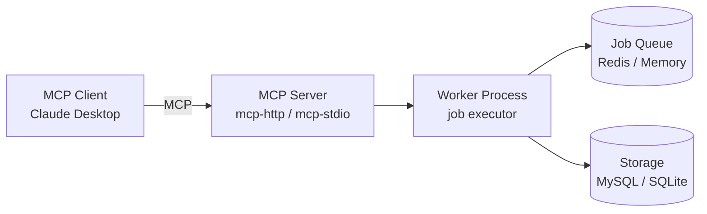

# MCP Server

## Overview

jobworkerp-rs can act as a [Model Context Protocol (MCP)](https://modelcontextprotocol.io/) **server**, exposing its Runners and Workers as MCP tools. This lets MCP clients such as Claude Desktop discover and execute jobworkerp jobs directly, without using the gRPC interface.

This is distinct from the [MCP Proxy](./runners/mcp-proxy.md) runner, which makes jobworkerp a *client* of external MCP servers. Here, jobworkerp is the *server* and the LLM client is the consumer.



The MCP Server only accepts requests and enqueues jobs; a Worker process performs the actual execution. In `all-in-one` mode both run in a single process.

## Deployment Modes

### All-in-One (development / single node)

Runs the MCP Server and Worker in one process:

```bash
MCP_ENABLED=true ./all-in-one
```

By default `all-in-one` serves gRPC; set `MCP_ENABLED=true` to switch it into MCP Server mode.

### Scalable (production)

Runs the MCP Server and Worker as separate processes that communicate via Redis/MySQL:

```bash
# Worker process (job execution)
./worker

# MCP Server over HTTP transport
./mcp-http

# or MCP Server over stdio transport
./mcp-stdio
```

> `mcp-http` / `mcp-stdio` do not run standalone — a Worker process must be running separately, and both must share the same storage backend (`STORAGE_TYPE`, `DATABASE_URL`, `REDIS_URL`).

## Transports

### HTTP (`mcp-http`)

Streamable HTTP transport, suitable for browser-based clients or HTTP proxy connections.

| Variable | Description | Default |
|----------|-------------|---------|
| `MCP_ADDR` | Bind address | `127.0.0.1:8000` |
| `MCP_AUTH_ENABLED` | Enable Bearer authentication | `false` |
| `MCP_AUTH_TOKENS` | Valid tokens, comma-separated | `demo-token` |

### stdio (`mcp-stdio`)

stdio transport for clients that communicate over stdin/stdout, such as Claude Desktop.

```json
{
  "mcpServers": {
    "jobworkerp": {
      "command": "/path/to/mcp-stdio",
      "env": {
        "DATABASE_URL": "sqlite://./jobworkerp.db",
        "STORAGE_TYPE": "Scalable",
        "REDIS_URL": "redis://localhost:6379"
      }
    }
  }
}
```

## Configuration

| Variable | Description | Default |
|----------|-------------|---------|
| `MCP_ENABLED` | Enable MCP Server mode in `all-in-one` | `false` |
| `MCP_ADDR` | HTTP bind address (`mcp-http` / all-in-one) | `127.0.0.1:8000` |
| `STORAGE_TYPE` | `Standalone` or `Scalable` | `Standalone` |
| `DATABASE_URL` | Database connection URL | `sqlite://./jobworkerp.db` |
| `REDIS_URL` | Redis connection URL (required for `Scalable`) | - |
| `MCP_SET_NAME` | Expose only the tools in this FunctionSet | - |
| `MCP_EXCLUDE_RUNNER` | Exclude Runners from the tool list | `false` |
| `MCP_EXCLUDE_WORKER` | Exclude Workers from the tool list | `false` |
| `MCP_STREAMING` | Collect streaming job output into the result | `false` |
| `MCP_TIMEOUT_SEC` | Tool execution timeout (seconds) | - |

## Exposed Tools

The MCP Server exposes two kinds of tools:

- **Runners** — built-in or plugin execution engines (`COMMAND`, `HTTP_REQUEST`, `PYTHON_COMMAND`, `GRPC_UNARY`, `DOCKER`, `LLM`, `WORKFLOW`, custom plugins). Executing a Runner tool creates a temporary Worker for that single call.
- **Workers** — pre-configured jobs already registered in jobworkerp. Executing a Worker tool reuses the existing Worker.

Use `MCP_EXCLUDE_RUNNER` / `MCP_EXCLUDE_WORKER` to expose only one kind, or `MCP_SET_NAME` to expose a curated [FunctionSet](./function.md).

Runners and Workers that support multiple methods (MCP/Plugin runners, the `WORKFLOW` runner's `run`/`create`, the `LLM` runner's `completion`/`chat`) are exposed as `name___method` tools. For example, `mcp-server-fetch___fetch` or `my-workflow-worker___create`.

## Tool Call Format

Each tool's argument shape is reflected directly in its advertised `inputSchema`, so passing arguments as the schema describes always works. The shape differs by target:

### Runner tools (direct execution)

A Runner needs both its init `settings` and call `arguments`, so the schema wraps them:

```json
{
  "settings": {
    "...": "runner-specific init settings (optional)"
  },
  "arguments": {
    "...": "execution arguments"
  }
}
```

Example — `COMMAND`:

```json
{ "arguments": { "command": "echo", "args": ["Hello, World!"] } }
```

### Worker tools (pre-configured)

A Worker's settings are fixed at creation time, so `settings` is not needed. Arguments are passed **directly at the top level** with no `settings`/`arguments` wrapper. The tool's `inputSchema` is the Worker's argument schema as-is.

For a **WORKFLOW Worker**, the advertised `inputSchema` is the workflow definition's own `input` schema. Pass the workflow input fields at the top level; jobworkerp wraps them into the workflow `input` automatically:

```json
{ "owner": "jobworkerp-rs", "repo": "jobworkerp-rs" }
```

A non-`run` WORKFLOW method invoked as `worker_name___create` is **not** wrapped into the workflow `input`. Pass that method's own schema (for `create`: `workflow_data` / `name`) at the top level instead.

## Streaming

When `MCP_STREAMING=true`, results from long-running jobs are streamed server-side and collected into the tool result. This helps with commands that produce large output and with real-time LLM text generation.

## Authentication

`mcp-http` supports Bearer token authentication:

```bash
export MCP_AUTH_ENABLED=true
export MCP_AUTH_TOKENS="token1,token2,token3"
./mcp-http
```

TLS/HTTPS (typically via a reverse proxy) is strongly recommended for production. For internal-only use, bind to a loopback address (`MCP_ADDR=127.0.0.1:8000`).

## Restricting the Tool Surface

For sensitive environments, narrow what the server exposes:

```bash
# Runners only (exclude Workers)
export MCP_EXCLUDE_WORKER=true

# Expose only a specific FunctionSet
export MCP_SET_NAME=public-tools
```

## Error Mapping

jobworkerp errors are mapped to MCP error codes:

| jobworkerp error | MCP error |
|------------------|-----------|
| `NotFound` | `METHOD_NOT_FOUND` |
| `InvalidParameter` | `INVALID_PARAMS` |
| `WorkerNotFound` | `METHOD_NOT_FOUND` |
| other | `INTERNAL_ERROR` |

## Troubleshooting

- **Tools do not appear**: check `MCP_EXCLUDE_RUNNER` / `MCP_EXCLUDE_WORKER`, verify `MCP_SET_NAME` matches an existing FunctionSet, and confirm Runners/Workers are registered in the database.
- **Server starts but jobs never complete**: in Scalable mode, ensure a Worker process is running and shares the same `STORAGE_TYPE` / `DATABASE_URL` / `REDIS_URL`.
- **Authentication errors**: with `MCP_AUTH_ENABLED=true`, the client must send an `Authorization: Bearer <token>` header whose token is listed in `MCP_AUTH_TOKENS`.
