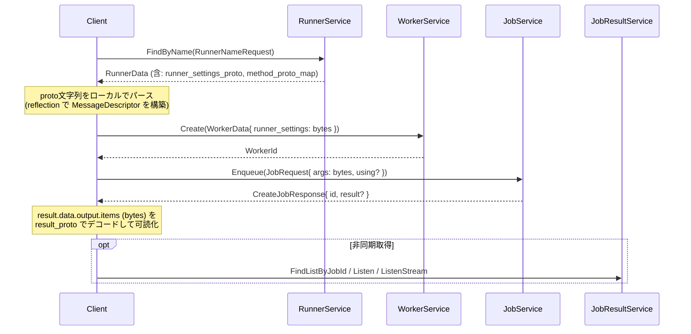

# gRPC Client実装

## 概要 — 2系統のクライアント API

jobworkerp-rs のクライアント API は大きく2系統あります。

| 観点 | `JobService.Enqueue*` を直接呼ぶ | `FunctionService.Call` |
|------|-----------------------------------|------------------------|
| ペイロード形式 | protobuf binary (`bytes`) | JSON 文字列 |
| 引数のスキーマ取り回し | クライアント側で reflection が必要 | サーバー側で JSON → protobuf 変換 |
| 通信効率 | 高い (binary) | 中 (テキスト経由) |
| ストリーミング | `EnqueueForStream` / `EnqueueWithClientStream` 対応 | `Call` がストリーム返却 |
| 主な用途 | バックエンド間呼び出し、CLI、サーバー間連携 | ブラウザ (gRPC-Web)、スクリプティング |

このページは前者、すなわち **`JobService.Enqueue*` を直接呼ぶ場合に必要となる protobuf reflection の取り扱い** を解説します。後者については [Function](./function.md) と [gRPC-Web API](./grpc-web-api.md) を参照してください。

## 動的スキーマモデル — bytes フィールドと proto 文字列の対応

`WorkerData` / `JobRequest` / `JobResultData` のうち、Runner ごとに型が変わるフィールドはすべて **protobuf binary を持つ `bytes` フィールド** です。クライアントは事前にそれぞれに対応する **proto 定義文字列** を `RunnerService` から取得し、protobuf reflection でローカルに descriptor を構築してから encode / decode する必要があります。

| `bytes` フィールド (送受信) | 対応する proto 定義 (string) |
|---------------------------|------------------------------|
| `WorkerData.runner_settings` | `RunnerData.runner_settings_proto` |
| `JobRequest.args` | `RunnerData.method_proto_map.schemas[using].args_proto` |
| `JobResultData.output.items` | `RunnerData.method_proto_map.schemas[using].result_proto` |
| `ResultOutputItem.data` / `final_collected` (ストリーミング時) | 同上 `result_proto` |

マルチメソッドな Runner (LLM, WORKFLOW, MCP, Plugin) では `JobRequest.using` で `method_proto_map.schemas` のキー (例: `"chat"`, `"run"`) を指定します。詳細は本ページ「マルチメソッドRunner と `using`」節を参照。



## 手順 — `grpcurl` を使った最小のフロー

`grpc-front` は既定で gRPC reflection を有効化しています (`tonic_reflection`)。よって追加設定なしで `grpcurl` 等の汎用ツールでサービス一覧の探索とリクエスト送信ができます。

### 0. 事前確認

```bash
# サービス一覧
grpcurl -plaintext localhost:9000 list

# 関心のあるサービスの RPC とメッセージ
grpcurl -plaintext localhost:9000 list jobworkerp.service.RunnerService
grpcurl -plaintext localhost:9000 describe jobworkerp.service.JobRequest
```

### 1. RunnerData を取得して proto 文字列を抜き出す

```bash
grpcurl -plaintext -d '{"name":"COMMAND"}' \
  localhost:9000 jobworkerp.service.RunnerService/FindByName \
  > runner.json
```

`runner.json` の中身 (抜粋イメージ):

```json
{
  "data": {
    "id": { "value": "1" },
    "data": {
      "name": "COMMAND",
      "runnerType": "RUNNER_TYPE_COMMAND",
      "runnerSettingsProto": "syntax = \"proto3\";\nmessage CommandRunnerSettings { ... }",
      "methodProtoMap": {
        "schemas": {
          "run": {
            "argsProto": "syntax = \"proto3\";\nmessage CommandArgs { string command = 1; repeated string args = 2; ... }",
            "resultProto": "syntax = \"proto3\";\nmessage CommandResult { ... }",
            "outputType": "NON_STREAMING"
          }
        }
      }
    }
  }
}
```

`runnerSettingsProto` / `argsProto` / `resultProto` をそれぞれファイルに書き出して、後段でローカル proto としてコンパイル/パースします。これらは **単一 message 定義 / import なし** が前提です ([プラグイン開発](./plugin-development.md) も参照)。

### 2. 引数バイト列を作る

`grpcurl` の JSON 入力では `bytes` 型は **Base64 文字列** で受け渡します (proto3 JSON Mapping 仕様)。よって何らかの方法で「JSON / YAML 等の構造化データ → protobuf binary → Base64」の変換が必要です。

汎用的には `protoc --encode` を使う方法があります:

```bash
# args.proto に上で取り出した argsProto を保存
echo 'CommandArgs { command: "echo" args: "hello" }' \
  | protoc --encode=CommandArgs args.proto \
  | base64 -w0 > args.b64
```

(プログラム言語からは reflection ライブラリで encode するほうが現実的です — 「言語別実装ガイド」節を参照)

### 3. Worker を作る

```bash
RUNNER_SETTINGS_B64=""   # COMMAND は設定不要なので空
grpcurl -plaintext -d "$(cat <<EOF
{
  "name": "echo-worker",
  "description": "",
  "runnerId": { "value": "1" },
  "runnerSettings": "${RUNNER_SETTINGS_B64}",
  "responseType": "DIRECT",
  "storeSuccess": true,
  "storeFailure": true
}
EOF
)" localhost:9000 jobworkerp.service.WorkerService/Create
```

レスポンスから `WorkerId` を得ます。

### 4. Job を enqueue する

```bash
ARGS_B64=$(cat args.b64)
grpcurl -plaintext -d "$(cat <<EOF
{
  "workerId": { "value": "1234567890" },
  "args": "${ARGS_B64}"
}
EOF
)" localhost:9000 jobworkerp.service.JobService/Enqueue
```

`responseType=DIRECT` で作った Worker なら、レスポンスの `result.data.output.items` (Base64) が直接返ります。それ以外は `JobResultService.FindListByJobId` で後から取得します。

### 5. 結果を decode する

`output.items` を Base64 デコードしたバイト列を、Step 1 で取得した `resultProto` でパースすれば構造化された JSON / オブジェクトに戻せます。

## 言語別実装ガイド

protobuf reflection を扱える任意のライブラリで実装できます。以下は代表例です。**いずれの言語でも `RunnerService.FindByName` で proto 文字列を取得 → ローカルでパース → bytes へ encode、というフローは共通** です。

### Rust (汎用パターン)

依存例:

```toml
[dependencies]
prost = "0.14"
prost-reflect = "0.16"
tonic = "0.14"
tonic-prost-build = "0.14"
serde_json = "1"
```

proto 文字列をランタイムで FileDescriptorSet にコンパイルする方針 (`tonic-prost-build` または `protoc -o` を使う) と、`prost-reflect::DescriptorPool::decode_file_descriptor_set` でロードして `DynamicMessage::deserialize(descriptor, &serde_json::Value)` → `encode_to_vec()` で bytes 化する方針が一般的です。decode 側は `DynamicMessage::decode(descriptor, bytes)` → `serde_json::to_value(&msg)` で JSON 化します。

> **参考情報**: 公式 Rust client crate **[jobworkerp-client-rs](https://github.com/jobworkerp-rs/jobworkerp-client-rs)** には、`RunnerService.FindByName` → descriptor 構築 → JSON 入力の bytes 化 → `WorkerService.Create` → `JobService.Enqueue` → `output` の JSON 化、までの一連を `setup_worker_and_enqueue_with_json` 等のヘルパーで実装した実例があります。CLI バイナリ `jobworkerp-client` の `worker create --settings '{...}'` / `job enqueue --args '{...}'` も内部でこの変換を行っています ([クライアント実行例](./client-usage.md))。

### TypeScript / ブラウザ

依存例 (npm):

```json
{
  "dependencies": {
    "protobufjs": "^7.5.4",
    "nice-grpc-web": "^3.3.9"
  }
}
```

`protobufjs` の `parse(protoString).root` は依存解決なしに単一 proto 文字列を受け取り、`Type.encode(value).finish()` で `Uint8Array` を生成、`Type.decode(bytes).toObject(...)` で JSON 化できます。最初に見つかった message 型を取り出すヘルパー (`findFirstType`) を併用すると、`runnerSettingsProto` / `argsProto` / `resultProto` のように先頭 message のみを使うケースで便利です。

要点 (擬似コード):

```ts
import * as protobuf from "protobufjs";

const findFirstType = (ns: protobuf.NamespaceBase): protobuf.Type | null => {
  for (const nested of ns.nestedArray) {
    if (nested instanceof protobuf.Type) return nested;
    if (nested instanceof protobuf.Namespace) {
      const found = findFirstType(nested);
      if (found) return found;
    }
  }
  return null;
};

// args の encode
const root = protobuf.parse(argsProto).root;
const ArgsType = findFirstType(root)!;
const errMsg = ArgsType.verify(jobArgsJson);
if (errMsg) throw new Error(errMsg);
const argsBytes = ArgsType.encode(ArgsType.create(jobArgsJson)).finish();

// JobRequest を生成して enqueue (生成済み ts-proto / @bufbuild クライアント経由)
const req = JobRequest.create({ workerId: { value: workerId }, args: argsBytes });
const res = await jobClient.enqueue(req);

// 結果の decode
const resultRoot = protobuf.parse(resultProto).root;
const ResultType = findFirstType(resultRoot)!;
const decoded = ResultType.decode(res.result!.data!.output!.items);
const json = ResultType.toObject(decoded, { defaults: true, enums: String, longs: String });
```

> **より便利な方法**: 公式管理 UI **[admin-ui](https://github.com/jobworkerp-rs/admin-ui)** が、上記パターン (`findFirstType` + `protobuf.parse` + `nice-grpc-web` クライアント) で `RunnerData` から動的フォームを生成し、JobService / WorkerService を直接呼び出す実装を提供しています。`src/pages/jobs/enqueue.tsx` (引数 encode 例)、`src/pages/workers/edit.tsx` (runner_settings の双方向変換例) が参考になります。

ブラウザから使う場合は `EnqueueForStream` などサーバーストリームに対応した gRPC-Web 構成が必要です。詳細は [gRPC-Web API](./grpc-web-api.md) を参照してください。

### Python (指針のみ)

- `grpc_tools.protoc` で `runner_settings_proto` / `args_proto` / `result_proto` を一時ファイルに書き出してランタイムコンパイル
- もしくは `google.protobuf.descriptor_pb2` + `descriptor_pool` で動的に `FileDescriptorProto` を構築
- `google.protobuf.json_format.Parse` / `MessageToJson` で JSON ⇄ message 変換、`SerializeToString()` で bytes 化

### Go (指針のみ)

- `github.com/jhump/protoreflect/desc/protoparse` で proto 文字列をパースし `desc.MessageDescriptor` を取得
- `github.com/jhump/protoreflect/dynamic` の `dynamic.NewMessage(md)` を使い `UnmarshalJSON` / `Marshal` で双方向変換

### 共通の注意

`runner_settings_proto` / `args_proto` / `result_proto` は **単一 message 定義** で、外部 import を持たない自己完結したスキーマです ([プラグイン開発](./plugin-development.md) で定義側の制約を解説)。よってどの言語でも proto 文字列単体をパースするだけで完結します。

## マルチメソッドRunner と `using`

- 単一メソッドの Runner (例: `COMMAND`, `HTTP_REQUEST`) は `method_proto_map.schemas` に `"run"` 1エントリのみ。`JobRequest.using` は省略可
- マルチメソッドの Runner (`LLM`, `WORKFLOW`, `MCP_SERVER`, `PLUGIN`) は `using` を明示する必要がある場合があります。例:
  - `LLM` runner で `chat` メソッドを使う → `using: "chat"`
  - `WORKFLOW` runner で再利用可能ワークフロー作成 → `using: "create"`
- `MethodSchema.require_client_stream=true` のメソッド (例: クライアントストリーミングが必要な統合) は `JobService.EnqueueWithClientStream` を使う必要があります
- `JobResultData.using` には実行時に確定したメソッド名が記録されるため、retry や periodic 再実行時に正しく復元されます

## 結果取得モード (response_type 別)

| `WorkerData.response_type` | 結果の取得方法 |
|---------------------------|----------------|
| `NO_RESULT` (デフォルト) | `Enqueue` レスポンスは `JobId` のみ。`store_success` / `store_failure` を有効にした場合のみ `JobResultService.FindListByJobId` で取得可能 |
| `DIRECT` | `Enqueue` のレスポンス内 `CreateJobResponse.result` に同期返却 |
| `broadcast_results=true` (response_type と独立) | `JobResultService.Listen` (ロングポーリング) / `ListenByWorker` (worker 単位ストリーム) / `ListenStream` (ストリーム結果) で `1:n` 受信可能 |

詳細は [ジョブキューと結果取得](./job-queue.md) と [ストリーミング](./streaming.md) を参照してください。

**いずれのモードでも、`output.items` (`bytes`) のデコードには `result_proto` から構築した descriptor が必要** です。

## 構造化データから bytes への変換 (補足)

入力は必ずしも JSON である必要はありません。YAML や独自構造体、ハッシュマップ等でも、`serde_json::Value` (Rust) や `dict` / `object` (Python / TS) のような中間表現を経由すれば、reflection ライブラリで encode できます。

例 (Rust):

```rust
let value: serde_json::Value = serde_yaml::from_str(yaml_str)?;
// その上で DynamicMessage::deserialize(descriptor, &value)? → encode_to_vec()
```

## デバッグ・運用 tips

- `grpcurl -plaintext localhost:9000 list` でサービス一覧、`describe <fully-qualified-name>` でメッセージ定義を取得できます
- `RunnerService.FindByName` のレスポンスから `runnerSettingsProto` / 各メソッドの `argsProto` / `resultProto` をそのまま読めば proto 定義が手に入ります
- `JobResultService.Listen*` のレスポンスは grpc メタデータヘッダ `x-job-result-bin` に `JobResult` の protobuf binary を載せて返すため、ヘッダもパース対象に含める必要があります
- スキーマ検証フラグ (例: `WORKFLOW_SKIP_SCHEMA_VALIDATION`) など、サーバー側挙動の調整は [設定と環境変数](./configuration.md) を参照

## 参考実装

- **[jobworkerp-client-rs](https://github.com/jobworkerp-rs/jobworkerp-client-rs)** — Rust 製の公式 CLI と client library。`jobworkerp-client runner find -i <id> --no-truncate` で `runnerSettingsProto` / `argsProto` / `resultProto` の生文字列を出力でき、`worker create --settings '{...}'` / `job enqueue --args '{...}'` は内部で本ページの reflection 変換を行います。ライブラリとして組み込めば自前で reflection を書く必要がありません ([クライアント実行例](./client-usage.md) も参照)
- **[admin-ui](https://github.com/jobworkerp-rs/admin-ui)** — TypeScript + Vite + nice-grpc-web のリファレンス UI。`protobufjs` で proto 文字列を動的解析しフォーム生成・enqueue する実装が含まれます

## 関連ドキュメント

- [クライアント実行例](./client-usage.md) — `jobworkerp-client` CLI の使用例
- [Function](./function.md) — `FunctionService` (JSON ベース) の概要
- [gRPC-Web API](./grpc-web-api.md) — ブラウザから JSON で呼ぶ場合の API
- [ジョブキューと結果取得](./job-queue.md) — `response_type` / `store_*` / `broadcast_results` の意味
- [ストリーミング](./streaming.md) — `EnqueueForStream` / `ListenStream` の取り扱い
- [プラグイン開発](./plugin-development.md) — proto 定義側の制約 (単一 message / import なし)
- proto 定義: [`runner.proto`](https://github.com/jobworkerp-rs/jobworkerp-rs/blob/main/proto/protobuf/jobworkerp/data/runner.proto), [`worker.proto`](https://github.com/jobworkerp-rs/jobworkerp-rs/blob/main/proto/protobuf/jobworkerp/data/worker.proto), [`job.proto`](https://github.com/jobworkerp-rs/jobworkerp-rs/blob/main/proto/protobuf/jobworkerp/service/job.proto), [`job_result.proto`](https://github.com/jobworkerp-rs/jobworkerp-rs/blob/main/proto/protobuf/jobworkerp/data/job_result.proto), [`common.proto`](https://github.com/jobworkerp-rs/jobworkerp-rs/blob/main/proto/protobuf/jobworkerp/data/common.proto)
