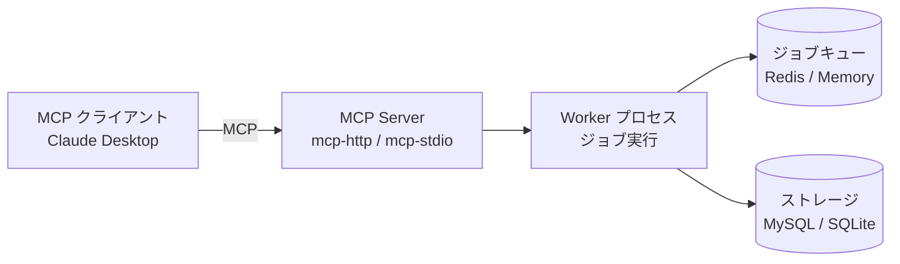

# MCP Server

## 概要

jobworkerp-rs は [Model Context Protocol (MCP)](https://modelcontextprotocol.io/) の **サーバー** として動作し、Runner と Worker を MCP ツールとして公開できます。これにより Claude Desktop などの MCP クライアントから、gRPC を介さずに jobworkerp のジョブを直接実行できます。

これは [MCP プロキシ](./runners/mcp-proxy.md) Runner（jobworkerp が外部 MCP サーバーの *クライアント* となる機能）とは別物です。ここでは jobworkerp が *サーバー* 側となり、LLM クライアントが利用者になります。



MCP Server はリクエストを受けてジョブをキューに積むだけで、実際の実行は Worker プロセスが担います。`all-in-one` モードでは両者が単一プロセスで動作します。

## デプロイメント構成

### All-in-One（開発・単一ノード向け）

MCP Server と Worker を単一プロセスで起動します。

```bash
MCP_ENABLED=true ./all-in-one
```

`all-in-one` はデフォルトで gRPC を提供します。`MCP_ENABLED=true` を指定すると MCP Server モードに切り替わります。

### Scalable（本番向け）

MCP Server と Worker を別プロセスで起動し、Redis/MySQL 経由で通信します。

```bash
# Worker プロセス（ジョブ実行）
./worker

# HTTP transport の MCP Server
./mcp-http

# または stdio transport の MCP Server
./mcp-stdio
```

> `mcp-http` / `mcp-stdio` は単独では動作しません。必ず Worker プロセスを別途起動し、両者で同じストレージ設定（`STORAGE_TYPE`・`DATABASE_URL`・`REDIS_URL`）を共有してください。

## トランスポート

### HTTP（`mcp-http`）

Streamable HTTP transport です。ブラウザベースのクライアントや HTTP プロキシ経由での接続に適しています。

| 環境変数 | 説明 | デフォルト |
|----------|------|-----------|
| `MCP_ADDR` | バインドアドレス | `127.0.0.1:8000` |
| `MCP_AUTH_ENABLED` | Bearer 認証を有効化 | `false` |
| `MCP_AUTH_TOKENS` | 有効なトークン（カンマ区切り） | `demo-token` |

### stdio（`mcp-stdio`）

stdin/stdout で通信するクライアント（Claude Desktop など）向けの stdio transport です。

```json
{
  "mcpServers": {
    "jobworkerp": {
      "command": "/path/to/mcp-stdio",
      "env": {
        "DATABASE_URL": "sqlite://./jobworkerp.db",
        "STORAGE_TYPE": "Scalable",
        "REDIS_URL": "redis://localhost:6379"
      }
    }
  }
}
```

## 設定

| 環境変数 | 説明 | デフォルト |
|----------|------|-----------|
| `MCP_ENABLED` | `all-in-one` で MCP Server モードを有効化 | `false` |
| `MCP_ADDR` | HTTP バインドアドレス（`mcp-http` / all-in-one） | `127.0.0.1:8000` |
| `STORAGE_TYPE` | `Standalone` または `Scalable` | `Standalone` |
| `DATABASE_URL` | データベース接続 URL | `sqlite://./jobworkerp.db` |
| `REDIS_URL` | Redis 接続 URL（`Scalable` 時必須） | - |
| `MCP_SET_NAME` | この FunctionSet 内のツールのみ公開 | - |
| `MCP_EXCLUDE_RUNNER` | Runner をツールリストから除外 | `false` |
| `MCP_EXCLUDE_WORKER` | Worker をツールリストから除外 | `false` |
| `MCP_STREAMING` | ストリーミングジョブの出力を結果に集約 | `false` |
| `MCP_TIMEOUT_SEC` | ツール実行のタイムアウト（秒） | - |

## 公開されるツール

MCP Server は 2 種類のツールを公開します。

- **Runner** — 組み込みまたはプラグインの実行エンジン（`COMMAND`・`HTTP_REQUEST`・`PYTHON_COMMAND`・`GRPC_UNARY`・`DOCKER`・`LLM`・`WORKFLOW`・カスタムプラグイン）。Runner ツールを実行すると、その 1 回の呼び出し用に一時 Worker が作成されます。
- **Worker** — jobworkerp に登録済みの事前設定済みジョブ。Worker ツールを実行すると、既存の Worker が再利用されます。

`MCP_EXCLUDE_RUNNER` / `MCP_EXCLUDE_WORKER` でどちらか一方のみを公開したり、`MCP_SET_NAME` で厳選した [FunctionSet](./function.md) のみを公開できます。

複数メソッドを持つ Runner/Worker（MCP/Plugin Runner、`WORKFLOW` Runner の `run`/`create`、`LLM` Runner の `completion`/`chat`）は `名前___メソッド` 形式のツールとして公開されます。例: `mcp-server-fetch___fetch`、`my-workflow-worker___create`。

## ツール呼び出し形式

各ツールの引数の形は、公開される `inputSchema` にそのまま反映されています。スキーマどおりに引数を渡せば正しく動作します。形式は対象によって異なります。

### Runner ツール（直接実行）

Runner は初期化設定（`settings`）と実行引数（`arguments`）の両方を必要とするため、これらをラップした形式になります。

```json
{
  "settings": {
    "...": "Runner 固有の初期化設定（オプション）"
  },
  "arguments": {
    "...": "実行引数"
  }
}
```

例 — `COMMAND`:

```json
{ "arguments": { "command": "echo", "args": ["Hello, World!"] } }
```

### Worker ツール（事前設定済み）

Worker は作成時に設定が確定しているため `settings` は不要です。引数は `settings`/`arguments` でラップせず、**トップレベルに直接**指定します。ツールの `inputSchema` は Worker の引数スキーマがそのまま公開されます。

**WORKFLOW Worker** の場合、公開される `inputSchema` はワークフロー定義の `input` スキーマそのものになります。ワークフローの入力フィールドをトップレベルに直接指定すると、jobworkerp が自動的にワークフローの `input` フィールドへ包みます。

```json
{ "owner": "jobworkerp-rs", "repo": "jobworkerp-rs" }
```

`worker_name___create` のような `run` 以外の WORKFLOW メソッドは、ワークフローの `input` 包装を **行いません**。そのメソッド自身のスキーマ（`create` の場合は `workflow_data` / `name`）をトップレベルに指定します。

## ストリーミング

`MCP_STREAMING=true` を設定すると、長時間実行ジョブの結果がサーバー側でストリーミングされ、ツール結果に集約されます。大量の出力を伴うコマンドや、LLM テキスト生成のリアルタイム表示に有用です。

## 認証

`mcp-http` は Bearer トークン認証をサポートします。

```bash
export MCP_AUTH_ENABLED=true
export MCP_AUTH_TOKENS="token1,token2,token3"
./mcp-http
```

本番環境では（通常はリバースプロキシ経由での）TLS/HTTPS の使用を強く推奨します。内部ネットワーク限定で使用する場合は、ループバックアドレスにバインドしてください（`MCP_ADDR=127.0.0.1:8000`）。

## 公開ツールの制限

機密性の高い環境では、公開する範囲を絞ってください。

```bash
# Runner のみ公開（Worker を除外）
export MCP_EXCLUDE_WORKER=true

# 特定の FunctionSet のみ公開
export MCP_SET_NAME=public-tools
```

## エラーマッピング

jobworkerp のエラーは MCP エラーコードにマッピングされます。

| jobworkerp エラー | MCP エラー |
|-------------------|-----------|
| `NotFound` | `METHOD_NOT_FOUND` |
| `InvalidParameter` | `INVALID_PARAMS` |
| `WorkerNotFound` | `METHOD_NOT_FOUND` |
| その他 | `INTERNAL_ERROR` |

## トラブルシューティング

- **ツールが表示されない**: `MCP_EXCLUDE_RUNNER` / `MCP_EXCLUDE_WORKER` の設定を確認し、`MCP_SET_NAME` が既存の FunctionSet と一致するか、Runner/Worker がデータベースに登録されているかを確認してください。
- **サーバーは起動するがジョブが完了しない**: Scalable モードでは、Worker プロセスが起動しており、同じ `STORAGE_TYPE` / `DATABASE_URL` / `REDIS_URL` を共有しているか確認してください。
- **認証エラー**: `MCP_AUTH_ENABLED=true` のときは、クライアントは `MCP_AUTH_TOKENS` に含まれるトークンで `Authorization: Bearer <token>` ヘッダーを送る必要があります。
